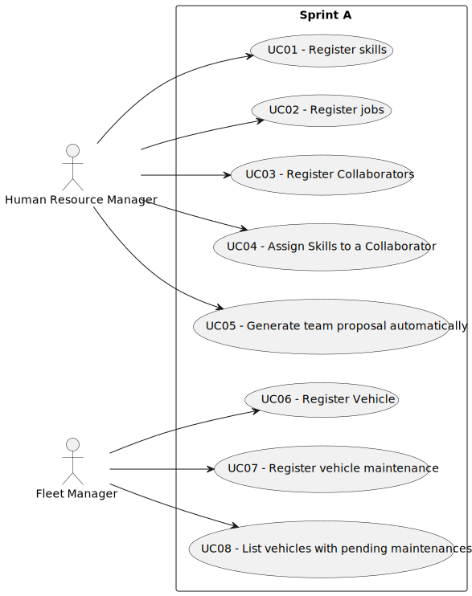

# Use Case Diagram (UCD)

**In the scope of this project, there is a direct relationship of _1 to 1_ between Use Cases (UC) and User Stories (US).**

However, be aware, this is a pedagogical simplification. On further projects and course units there may also exist _1 to N **and/or** N to 1_ relationships between UC and US.

**Insert below the Use Case Diagram in a SVG format**

**For each UC/US, it must be provided evidences of applying main activities of the software development process (requirements, analysis, design, tests and code). Gather those evidences on a separate file for each UC/US and set up a link as suggested below.**

# Use Cases / User Stories

| UC/US | Description                                                         |                   
|:------|:--------------------------------------------------------------------|
| US01  | [Register Skills](docs/sprintA/us001/US001.md)                      |
| US02  | [RegisterJobs](docs/sprintA/us002/Readme.md)                        |
| US03  | [Register Collaborators](docs/sprintA/us002/Readme.md)                     |
| US04  | [Assign skills to a collaborator](../../us006/Readme.md)            |
| US05  | [Team proposal automatically](../../us006/Readme.md)                |
| US06  | [Register Vehicle](../../us006/Readme.md)                           |
| US07  | [Register Vehicle maintneance](../../us006/Readme.md)               |
| US08  | [List vehihcles with a pending maintenance ](../../us006/Readme.md) |

