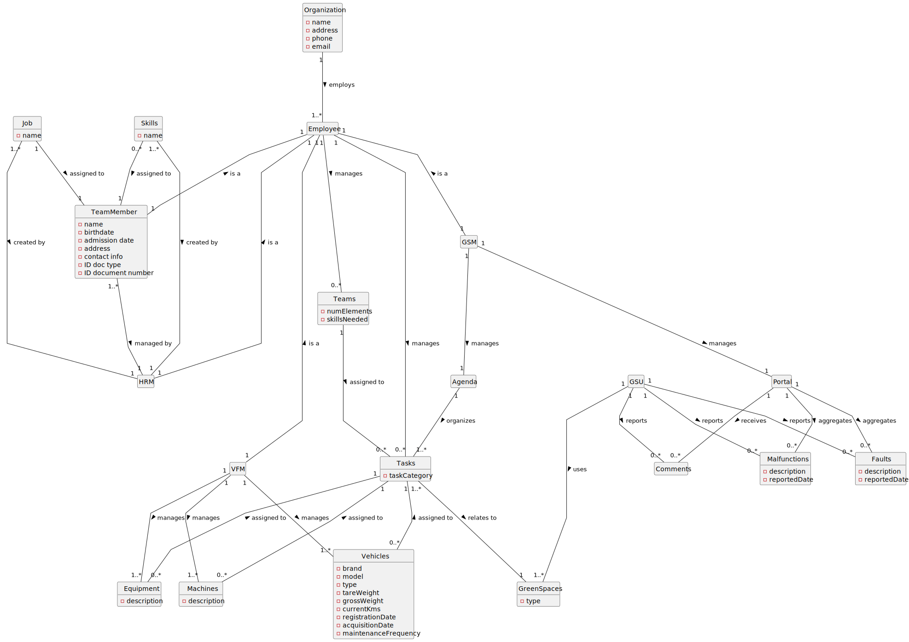

# Object-Oriented Analysis for Green Spaces Management System

## Introduction

This document outlines the object-oriented analysis conducted for the development of an IT solution aimed at supporting the management and maintenance of green spaces. Based on the client's specifications, conceptual classes and associations have been identified to construct a comprehensive domain model.

## Rationale for Identifying Conceptual Classes

Conceptual classes were identified by analyzing the client specifications, focusing on nouns (for concepts) and verbs (for relations) used in the description. The list of candidate conceptual classes was inspired by the categories suggested in "Applying UML and Patterns: An Introduction to Object-Oriented Analysis and Design and Iterative Development".

### Conceptual Class Categories

#### Business Transactions

- **Teams**: Groups of TeamMembers managed by an Employee, characterized by their number of elements and required skills.
- **Tasks**: Categories of work assigned to Teams and related to GreenSpaces, organized by an Agenda.

#### Transaction Line Items

- **Skills**: Abilities that a TeamMember can possess, created and assigned by HRM.
- **Job**: A role with specific responsibilities and required skills, created and assigned by HRM.

#### Product/Service Related

- **GreenSpaces**: Types of spaces Tasks are related to, managed by GSU.

#### Transaction Records

- **Malfunctions, Faults, Comments**: Records related to the operational status of green spaces, managed and reported through the Portal by GSU.

#### Roles of People or Organizations

- **Employee, TeamMember, HRM, GSM, VFM, GSU**: Various roles within the organization, each with distinct responsibilities and interactions within the system.

#### Noteworthy Events

- **Agenda**: A schedule organizing Tasks, managed by GSM.

#### Physical Objects

- **Vehicles, Machines, Equipment**: Objects required for the maintenance and management of GreenSpaces, managed by VFM.

#### Catalogs

- **Portal**: A platform aggregating reports and feedback on green spaces, managed by GSM.

#### Organizations

- **Organization**: The entity employing all Employees and overseeing the system's operations.

## Rationale for Identifying Associations

Associations were identified based on the relevance of connections between object instances, derived from common association patterns such as part-whole relationships, containment, description, and management or ownership links.

### Key Associations

- Organization employs Employee.
- Employee manages Teams and can be a TeamMember, HRM, GSM, or VFM.
- TeamMember is managed by HRM and can be assigned Skills.
- Jobs and Skills are created and assigned by HRM.
- Teams are assigned to Tasks, which relate to GreenSpaces.
- GSM manages the Portal and Agenda.
- VFM manages Vehicles, Machines, and Equipment.
- The Portal aggregates Malfunctions, Faults, and receives Comments.
- GSU manages GreenSpaces and reports issues through the Portal.

## Domain Model

The domain model diagram provides a visual representation of the identified conceptual classes and their associations. Attributes for each concept have been defined based on the specifications provided.

*Please note: The domain model diagram is to be included as an SVG file in the project documentation.*

## Conclusion

This analysis lays the groundwork for the design and implementation phases of the green spaces management system. The identified conceptual classes and associations form a robust domain model that aligns with the client's requirements and objectives for the project.
