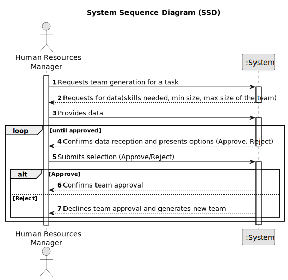

# US005 - Generate Team to perform a task

## 1. Requirements Engineering

### 1.1. User Story Description

As a HRM, I want to generate a team proposal automatically

### 1.2. Customer Specifications and Clarifications 

**From the specifications document:**

>	The responsibility for forming the team relies on HRM, who must introduce the number of employees   necessary to carry out the task as well as the desired skills.

>	Teams are temporary associations of employees until the task is completed.

**From the client clarifications:**

> **Question:** Should teams be static?
>
> **Answer:** No, we must be able to define teams without being static, and can be changed depending on the tasks.

> **Question:** Is each team responsible for HRM?
>
> **Answer:** The company manages tasks associated with the park, also managing the team that will carry them out.

### 1.3. Acceptance Criteria

* **AC1:** When a team is created, HRM can reject the proposal or accept the team.

### 1.4. Found out Dependencies

* There is a dependency on "US04 - As an HRM, I want to assign one or more skills to a collaborator.

### 1.5 Input and Output Data

**Input Data:**

* Typed data:
    * maximum team members
    * skills required
	

**Output Data:**

* Team generated by the program

### 1.6. System Sequence Diagram (SSD)

#
### 1.7 Other Relevant Remarks

* Collaborators are available if they are not assigned to any team