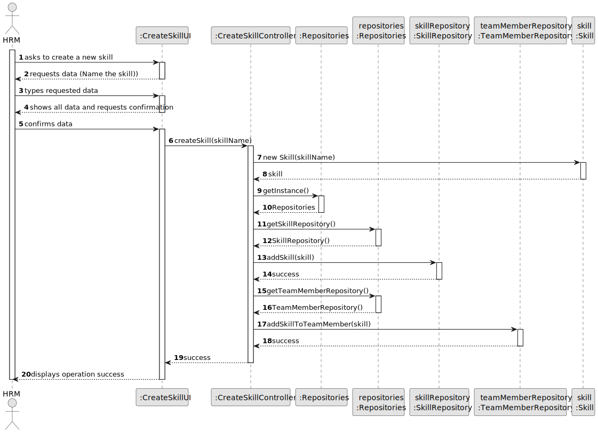
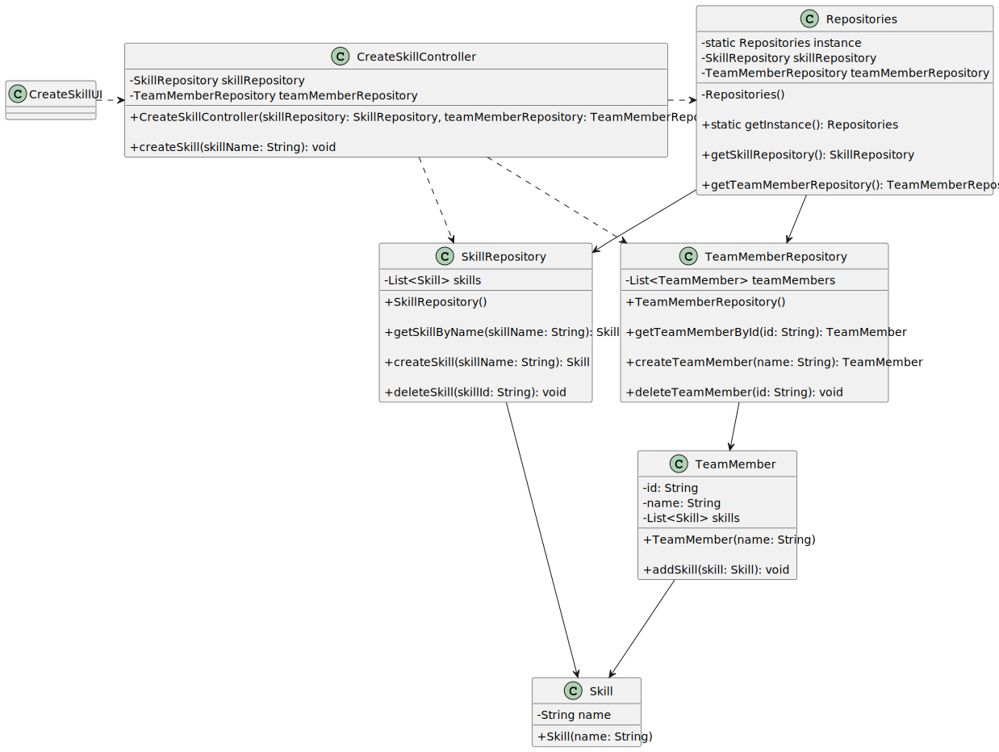

# US001 - As a HRM, I want to register skills that may be appointed to a collaborator.

## 3. Design - User Story Realization 

### 3.1. Rationale

| Interaction ID                                           | Question: Which class is responsible for...                 | Answer                        | Justification (with patterns)                                                                                |
|:---------------------------------------------------------|:------------------------------------------------------------|:------------------------------|:-------------------------------------------------------------------------------------------------------------|
| Step 1 - HRM asks to create a new skill 	                | ... interacting with the actor?                             | CreateSkillUI                 | Pure Fabrication: Pure Fabrication: The UI class is created to interact with the user and get the necessary inputs.                                                                                           |
|                                                          | ... coordinating the US?                                    | CreateSkillController         | Controller: The controller is responsible for handling the user request and coordinating the use case.       |
| Step 2 - System requests data (Name the skill)           | ... displaying form for actor input?                        | CreateSkillUI                 | Pure Fabrication: The UI class is responsible for displaying the form and getting the input from the user.   |
| Step 3 - HRM types requested data                        | ... temporaly keeping input data?                           | CreateSkillController         | IE: The controller has the necessary information and is responsible for temporarily storing the input data.  | 
| Step 4 - System shows all data and requests confirmation | ... displaying all the information before submitting?       | CreateSkillUI                 | Pure Fabrication: The UI class is responsible for displaying all the information before submitting.          |
| Step 5 - HRM confirms data			                    | ... knowing the user using the system?                      | CreateSkillUI                 | IE: The UI class interacts with the user and knows the user using the system.                                |        
| 	                                                        | ... instantiating a new Skill (Object)?                     | Skill                         | Creator: The Skill class is responsible for creating a new Skill object as it has the necessary information. |
| 		                                                    | ... validating all data (local validation,i.e.mandatory)?   | Skill                         | IE: The Skill class has the necessary information and is responsible for validating the data.                |
| 		                                                    | ... validating all data (global validation,i.e.duplicates)? | SkillRepository               | IE: The SkillRepository class has the necessary information and is responsible for validating the data globally. |
|                                                          | ... saving the created skill?                               | SkillRepository               | IE: The SkillRepository class has the necessary information and is responsible for saving the created skill. |
| 		                                                    | ... saving the inputted data?                               | SkillRepository               | IE: The SkillRepository class has the necessary information and is responsible for saving the inputted data. |
| Step 6 - System displays operation success	  	        | ... information operation sucess?                           | CreateSkillUI                 | Pure Fabrication: The UI class is responsible for displaying the operation success message.                  |              

### Systematization ##

According to the taken rationale, the conceptual classes promoted to software classes are: 

* Team Member 
* Skill

Other software classes (i.e. Pure Fabrication) identified: 

* CreateSkillUI
* CreatSkillController

## 3.2. Sequence Diagram (SD)

### Full Diagram

This diagram shows the full sequence of interactions between the classes involved in the realization of this user story.

## 3.3. Class Diagram (CD)

