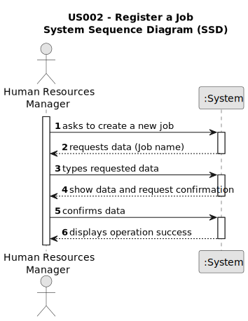

# US002 - Register a job.

## 1. Requirements Engineering

### 1.1. User Story Description

_As an HRM, I want to register a job._

### 1.2. Customer Specifications and Clarifications 

_The main occupation of employees such as designer, estimator, gardener, electrician, or mason, being inputted by the HRM._

_Client clarification, just a Job Name insertion is needed._

### 1.3. Acceptance Criteria

_AC1 - Required field filled with at least one word._

_AC2 - Only HRM can create a Job._

### 1.4. Found out Dependencies

_"US03 - Register a Collaborator" depends on this US, one Job must be selected to register a collaborator._

### 1.5 Input and Output Data

_Input typed Job name in text field._
_Output (in)success message._

### 1.6. System Sequence Diagram (SSD)

### 1.7 Other Relevant Remarks

  

