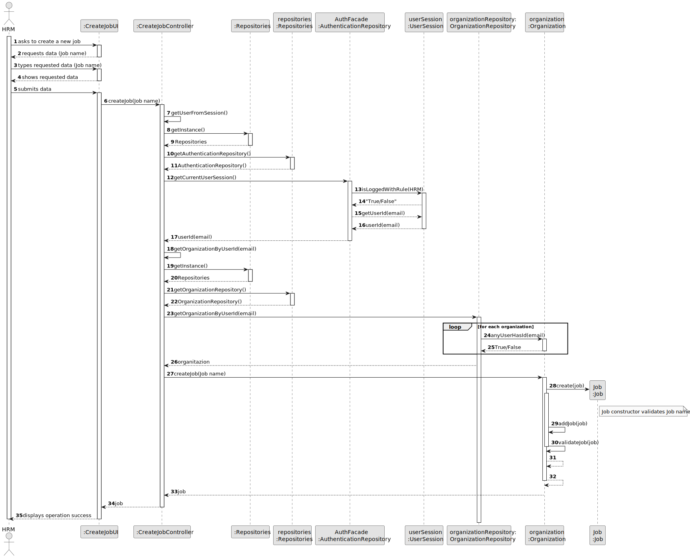

# US002 - As an HRM, I want to register a job. 

## 3. Design - User Story Realization 

### 3.1. Rationale

| Interaction ID                             | Question: Which class is responsible for...                 | Answer              | Justification (with patterns)                                                                       |
|:-------------------------------------------|:------------------------------------------------------------|:--------------------|:----------------------------------------------------------------------------------------------------|
| Step 1 - ask to create a new Job 		  | ... interacting with the actor?                             | CreateJobUI         | Pure Fabrication: there is no reason to assign this responsibility to any existing class in the DM. |
|                                            | ... coordinating the US?                                    | CreateJobController | Pure Fabrication(System Interaction Controller)                                                     |
| Step 2 - requests data                     | ... displaying form for actor input?                        | CreateJobUI         | Pure Fabrication(Interation with Actor)                                                             |
| Step 3 - types requested data              | ... temporaly keeping input data?                           | CreateJobUI         | Pure Fabrication(Interation with Actor)                                                             | 
| Step 4 - show data an request confirmation | ... displaying all the information before submitting?       | CreateJobUI         | Pure Fabrication(Interation with Actor)                                                             |
| Step 5 - confirms data			          | ... knowing the user using the system?                      | UserSession         | IE: see Auth component documentation.                                                               |        
| 	                                          | ... instantiating a new Job (Object)?                       | Organization        | Creator (Rule 1): in the DM Organization owns Jobs list.                                            |
|   		                                  | ... validating all data (local validation,i.e.mandatory)?   | Job                 | IE: owns its data.                                                                                  |
| 		                                      | ... validating all data (global validation,i.e.duplicates)? | Organization        | IE: knows all its jobs.                                                                             |
| 			  		                          | ... saving the created job?                                 | Organization        | IE: owns all its jobs.                                                                              |
| 		                                      | ... saving the inputted data?                               | Job                 | IE: object created previously has its own data.                                                     |
| Step 6 - dysplay operation sucess	  	  | ... information operation sucess?                           | CreateJobUI         | PureFabrication(Interation with Actor)                                                              |              

### Systematization ##

According to the taken rationale, the conceptual classes promoted to software classes are: 

* Organization
* Job

Other software classes (i.e. Pure Fabrication) identified: 

* CreateJobUI  
* CreateJobController

## 3.2. Sequence Diagram (SD)

### Full Diagram

This diagram shows the full sequence of interactions between the classes involved in the realization of this user story.

## 3.3. Class Diagram (CD)

