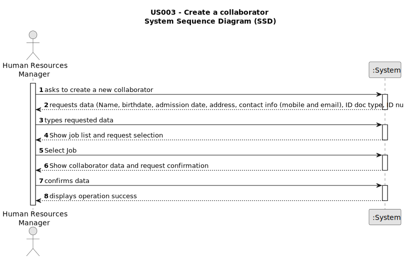

# # US003 - As an HRM, I want to register a collaborator with a job and fundamental characteristics.

## 1. Requirements Engineering

### 1.1. User Story Description

As an organization HRM, I want to create a new collaborator with a job and fundamental characteristics.

### 1.2. Customer Specifications and Clarifications 

**From the specifications document:**

A collaborator must be registered with a job and fundamental characteristics. 

Name, birthdate, admission date, address, contact info (mobile and email), ID doc type and respective number should be provided by HRM.

**From client meeting:**

What information is considered as Address?

Address information includes Street, city and Zip Code.

Must be some skill assigned in the new collaborator?

No, skills will be assigned in another US.

### 1.3. Acceptance Criteria

* **AC1:** Required fields (Name, birthdate, admission date, address, contact info (mobile and email), ID doc type, ID number, taxpayer ID, and Job are mandatory.
* **AC2:** The address must include street, city and Zipcode.
* **AC3:** When creating a collaborator with an existing doc type and doc number, the system must reject such operation.
* **AC4:** Only HRM can create a Job.

### 1.4. Found out Dependencies

* There is a dependency on "US002 - Register a Job" as there must be at least one Job name to classify the employee being created.

### 1.5 Input and Output Data

**Input Data:**

* Typed data:
  * Name
  * Birthdate
  * Admission date
  * Address (including street, city, and Zipcode)
  * Contact info (including mobile, email)
  * ID doc type
  * ID document number
  * Taxpayer ID
	
* Selected data:
  * Job

**Output Data:**

* (In)Success of the operation

### 1.6. System Sequence Diagram (SSD)

### 1.7 Other Relevant Remarks

* The created collaborator don´t have Skills assigned.