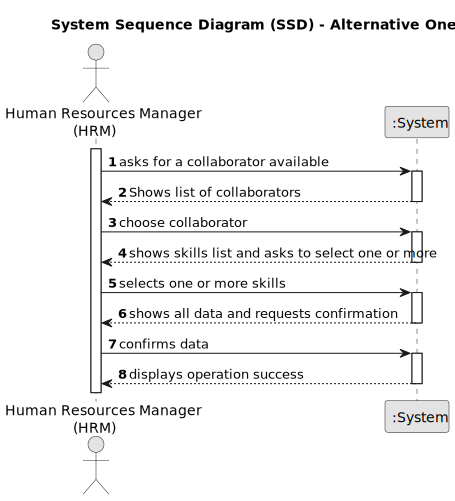
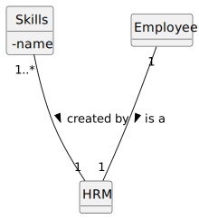

# US04 - As an HRM, I want to assign one or more skills to a collaborator.

## 1. Requirements Engineering

### 1.1. User Story Description

_As an HRM, I want to assign one or more skills to a collaborator._

### 1.2. Customer Specifications and Clarifications 

**From the specifications document:**

_The skills must be clearly defined and described._

_When assigning competence/s to a worker._

_It must be possible assigning one or more skills to a collaborator each time._

**From the client clarifications:**

> **Question:** "Is there a minimum or maximum number of skills?"
>
> **Answer:** "No."

> **Question:** "Is there any certification/proof needed to register a skill to a colaborator?"
>
> **Answer:** "No."

> **Question:** "Can a collaborator have no skills assigned?"
>
> **Answer:** "Yes."

### 1.3. Acceptance Criteria

_AC1 - The system allows HRM to assign one or more skills to a collaborator._

_AC2 - Must be a collaborator of the company._

_AC3 - It must be impossible to assign skills to collaborator who are not in the company's database._ 

### 1.4. Found out Dependencies

_US04 depends the US01._

### 1.5 Input and Output Data

_Input - Collaborator's name; worker's role; skills to be assigned._ 

_Output - Updated record of collaborator skills._

### 1.6. System Sequence Diagram (SSD)

### 1.7 Other Relevant Remarks

_Give clear feedback on the outcome of the skills assignment.
 Deal with pre-existing employee skills during assignment._

## 2. OO Analysis

### 2.1. Relevant Domain Model Excerpt

### 2.2. Other Remarks

__

## 3. Design - User Story Realization 

### 3.1. Rationale

**The rationale grounds on the SSD interactions and the identified input/output data.**

| Interaction ID | Question: Which class is responsible for... | Answer  | Justification (with patterns)  |
|:-------------  |:--------------------- |:------------|:---------------------------- |
| Step 1  		 |							 |             |                              |
| Step 2  		 |							 |             |                              |
| Step 3  		 |							 |             |                              |
| Step 4  		 |							 |             |                              |
| Step 5  		 |							 |             |                              |
| Step 6  		 |							 |             |                              |              
| Step 7  		 |							 |             |                              |
| Step 8  		 |							 |             |                              |
| Step 9  		 |							 |             |                              |
| Step 10  		 |							 |             |                              |  

### Systematization ##

According to the taken rationale, the conceptual classes promoted to software classes are:

* Class1
* Class2
* Class3

Other software classes (i.e. Pure Fabrication) identified:

* xxxxUI  
* xxxxController

## 3.2. Sequence Diagram (SD)

_In this section, it is suggested to present an UML dynamic view representing the sequence of interactions between software objects that allows to fulfill the requirements._

## 3.3. Class Diagram (CD)

_In this section, it is suggested to present an UML static view representing the main related software classes that are involved in fulfilling the requirements as well as their relations, attributes and methods._

# 4. Tests 
_In this section, it is suggested to systematize how the tests were designed to allow a correct measurement of requirements fulfilling._ 

**_DO NOT COPY ALL DEVELOPED TESTS HERE_**

**Test 1:** Check that it is not possible to create an instance of the Example class with null values. 

	@Test(expected = IllegalArgumentException.class)
		public void ensureNullIsNotAllowed() {
		Exemplo instance = new Exemplo(null, null);
	}

_It is also recommended to organize this content by subsections._

# 5. Construction (Implementation)

_In this section, it is suggested to provide, if necessary, some evidence that the construction/implementation is in accordance with the previously carried out design. Furthermore, it is recommeded to mention/describe the existence of other relevant (e.g. configuration) files and highlight relevant commits._

_It is also recommended to organize this content by subsections._ 

# 6. Integration and Demo 

_In this section, it is suggested to describe the efforts made to integrate this functionality with the other features of the system._

# 7. Observations

_In this section, it is suggested to present a critical perspective on the developed work, pointing, for example, to other alternatives and or future related work._