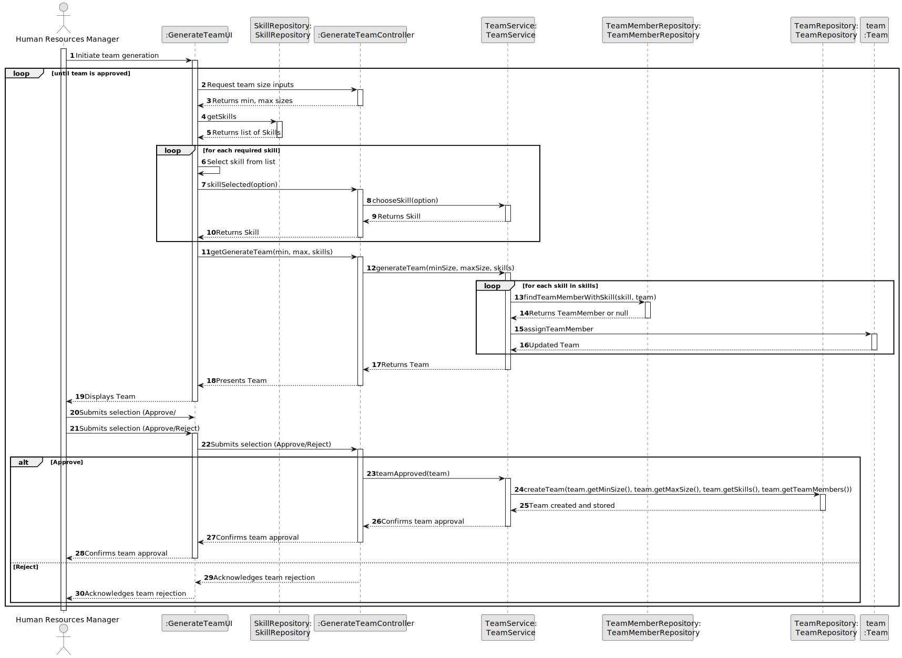

# US005 - Generate a Team

## 3. Design - User Story Realization

### 3.1. Rationale

_**Note that SSD - Alternative One is adopted.**_

| Interaction ID | Question: Which class is responsible for... | Answer                  | Justification (with patterns)                                                                                   |
|----------------|--------------------------------------------|-------------------------|-----------------------------------------------------------------------------------------------------------------|
| Step 1         | ... interacting with the actor?            | HRMUI                   | Pure Fabrication: there is no reason to assign this responsibility to any existing class in the Domain Model.   |
|                | ... coordinating the US?                   | HRMController           | Controller: Manages the user input and coordinates the team generation process.                                 |
|                | ... instantiating a new Team?              | TeamService             | Creator: Responsible for creating team instances based on given criteria.                                       |
|                | ... knowing the user using the system?     | UserSession             | Information Expert: Handles session data, including user credentials and roles.                                 |
| Step 2         | ... saving the inputted data?              | Team                    | Information Expert: Object created in step 1 has its own data, including team details.                          |
| Step 3         | ... knowing the employee skills to show?   | EmployeeRepository      | Information Expert: Manages retrieval of employee data based on skills.                                         |
| Step 4         | ... saving the selected skills?            | Team                    | Information Expert: Object modified in step 1 accumulates necessary skills for the team.                        |
| Step 5         | ... validating all data (local validation)?| Team                    | Information Expert: Owns its data and validates it according to business rules.                                 |
|                | ... validating all data (global validation)?| HRMController          | Controller: Verifies team data against global constraints and business rules.                                   |
|                | ... saving the created team?              | TeamService             | Creator: Saves the fully constructed team object within the system.                                             |
| Step 6         | ... informing operation success?          | HRMUI                   | Information Expert: Responsible for user interactions, confirming the outcome of operations.                     |

### Systematization

According to the taken rationale, the conceptual classes promoted to software classes are:

- TeamService
- Team
- EmployeeRepository

Other software classes (i.e., Pure Fabrication) identified:

- HRMUI
- HRMController

## 3.2. Sequence Diagram (SD)

### Full Diagram

This diagram shows the full sequence of interactions between the classes involved in the realization of this user story

### Partial Diagram
**Generate Team**

## 3.3. Class Diagram (CD)

`
