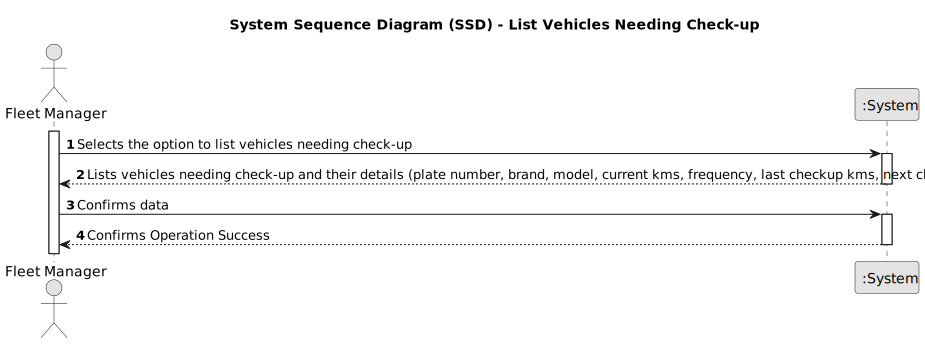

# US008 - List the vehicles needing the check-up.

## 1. Requirements Engineering

### 1.1. User Story Description

As an FM, I want to list the vehicles needing the check-up.

### 1.2. Customer Specifications and Clarifications 

**From the specifications document:**

[n/a]

**From the client clarifications:**

> **Question:** What are the requests/ input data to list the vehicles needing the check-up? Type of vehicle, Current Km and Maintenance/Check-up Frequency (in Kms) are sufficient?
>
> **Answer:** Current Km and Maintenance/Check-up Frequency (in Kms) are sufficient, yes;

> **Question:** What information will appear on the final list regarding the vehicle,besides the needing for check-up?
>
> **Answer:** Data that allow to identify the vehicle like Plate, brand and model, as well as, the data that allowed to select/insert te vehicle in the list, number of kms, frequency of checkup and the last checkup.

### 1.3. Acceptance Criteria

* **AC1:** The list must clearly identify the vehicles through: plate number, brand, model and the data (current kms, frequency, last checkup kms, next checkup) justified the checkup need.

* **AC2:** The list must contain all vehicles that have already exceeded the number of km required for the inspection or those that are close to it (5%).

### 1.4. Found out Dependencies

US08 depend on US06 - Register a vehicle including Brand, Model...Current Km, Register Date, Acquisition Date, Maintenance/Check-up Frequency (in Kms)...

US07 - As an FM, I wish to register a vehicle’s check-up.

### 1.5 Input and Output Data

**Output Data:**

     List of vehicles that need check-up

	 Data that identifies each vehicle [plate number, brand, model]

	 All data that justifies why the vehicle need a check-up [current kms, frequency, last checkup kms, next checkup]

### 1.6. System Sequence Diagram (SSD)

### 1.7 Other Relevant Remarks

[n/a]
