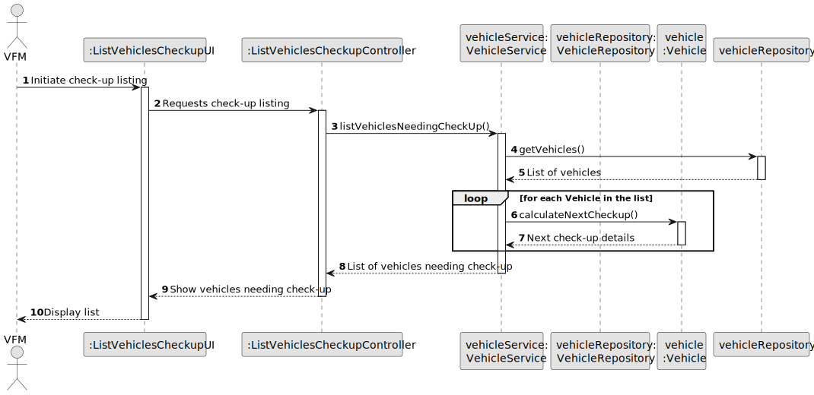
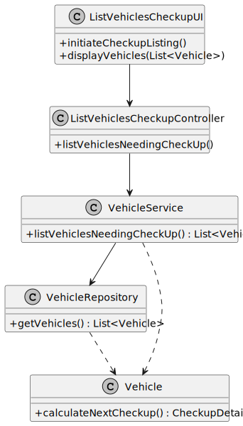

# US008 - List the Vehicles Needing the Check-up

## 3. Design - User Story Realization

### 3.1. Rationale

| Interaction ID | Question: Which class is responsible for...          | Answer                     | Justification (with patterns)                                                                                   |
|----------------|------------------------------------------------------|----------------------------|-----------------------------------------------------------------------------------------------------------------|
| Step 1         | ... interacting with the actor?                      | ListVehiclesCheckupUI      | Pure Fabrication: there is no reason to assign this responsibility to any existing class in the Domain Model.   |
|                | ... coordinating the US?                             | ListVehiclesCheckupController | Controller: Manages the flow between the user interface and the service layer.                                |
|                | ... gathering and processing vehicle data?           | VehicleService             | Information Expert: Has the necessary information and methods to process vehicle data.                          |
|                | ... accessing and retrieving vehicle data?           | VehicleRepository          | Information Expert: Directly accesses the data storage to fetch vehicle details.                                |
| Step 2         | ... presenting the list of vehicles needing check-up?| ListVehiclesCheckupUI      | Information Expert: Displays the processed information to the user.                                            |

### Systematization

According to the taken rationale, the conceptual classes promoted to software classes are:

- VehicleService
- VehicleRepository
- Vehicle

Other software classes (i.e. Pure Fabrication) identified: 

- ListVehiclesCheckupUI  
- ListVehiclesCheckupController

## 3.2. Sequence Diagram (SD)

### Full Diagram

This diagram shows the full sequence of interactions between the classes involved in the realization of this user story.

## 3.3. Class Diagram (CD)

