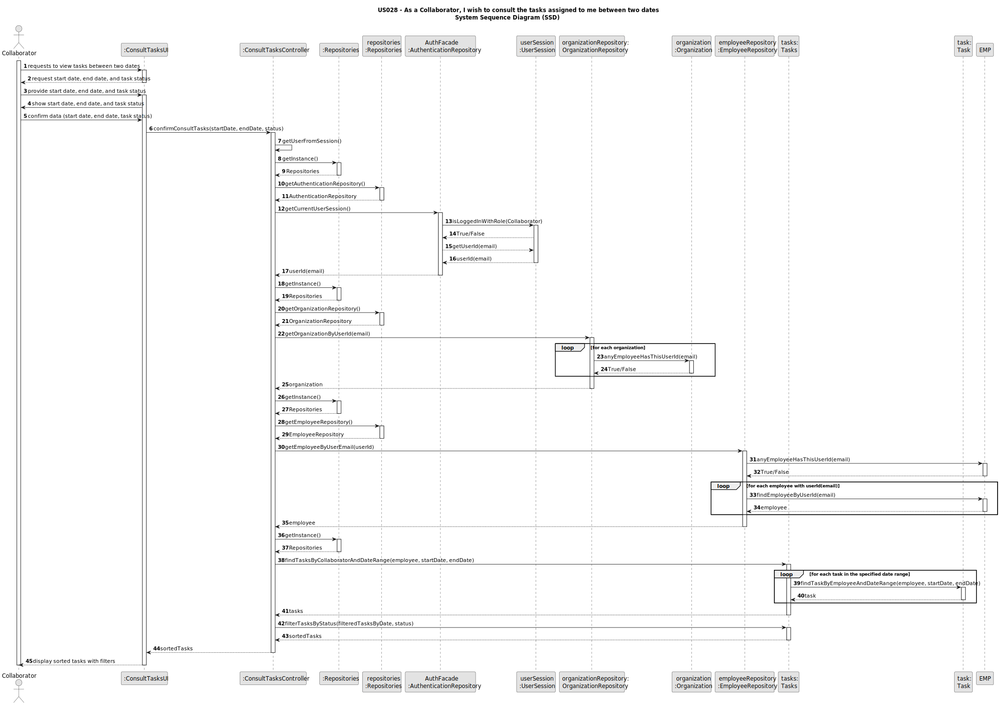
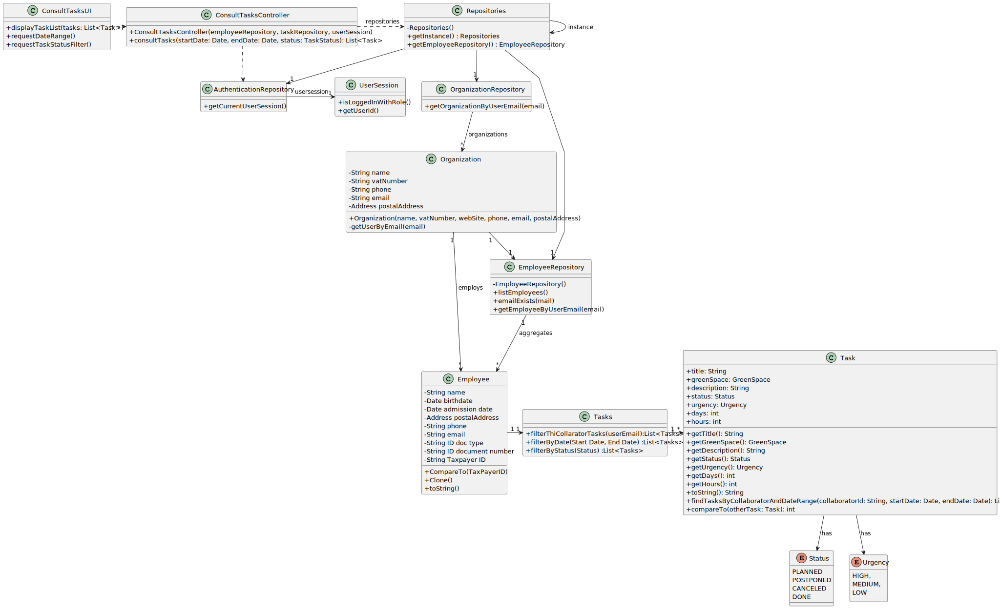

# US028 - As a Collaborator, I wish to consult the tasks assigned to me between two dates

## 3. Design - User Story Realization

### 3.1. Rationale

| Interaction ID                                                        | Question: Which class is responsible for...                             | Answer                | Justification (with patterns)                                                                          |
|:----------------------------------------------------------------------|:------------------------------------------------------------------------|:----------------------|:-------------------------------------------------------------------------------------------------------|
| Step 1 - requests to view tasks between two dates                     | ... interacting with the actor?                                         | ConsultTaskUI         | 	Pure Fabrication: there is no reason to assign this responsibility to any existing class in the DM.   |
|                                                                       | ... coordinating the US?                                                | ConsultTaskController | Controller: The controller is responsible for handling the user request and coordinating the use case. | 
| Step 2 - requests start date, end date, and task status               | ... displaying form for actor input?                                    | ConsultTasksUI        | Pure Fabrication (Interaction with Actor)                                                              |
| Step 3 - provides start date, end date, and task status               | ... temporally keeping input data?                                      | ConsultTasksUI        | Pure Fabrication (Interaction with Actor)                                                              | 
| Step 4 - shows start date, end date, and task status                  | ... displaying all the information before submitting?                   | ConsultTasksUI        | Pure Fabrication (Interaction with Actor)                                                              |
| Step 5 - confirm data (start date, end date, and task status)         | ... validating all data (local validation,e.g. mandatory)?              | Tasks                 | IE: the Task class knows and validates its own data.                                                   |
|                                                                       | ... validating all data (global validation,e.g. duplicates)?            | Task                  | IE: knows all tasks.                                                                                   |
|                                                                       | ... saving the task?                                                    | Task                  | IE: object created previously has its own data.                                                        |
| Step 6 - displays list of tasks sorted by date and filtered by status | ... informing operation success?                                        | ConsultTasksUI        | Pure Fabrication (Interaction with Actor)                                                              |              

### Systematization

According to the taken rationale, the conceptual classes promoted to software classes are: 

* Organization
* Employee 
* Task 

Other software classes (i.e. Pure Fabrication) identified: 

* ConsultTasksUI
* ConsultTasksController 

## 3.2. Sequence Diagram (SD)

### Full Diagram

This diagram shows the full sequence of interactions between the classes involved in the realization of this user story.

## 3.3. Class Diagram (CD)

