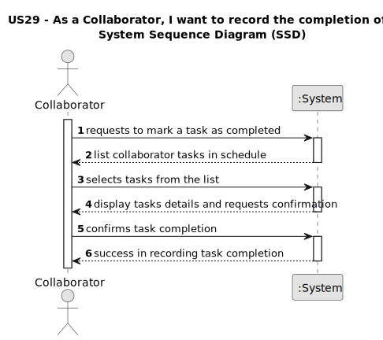

# US29 - As a Collaborator, I want to record the completion of a task.

## 1. Requirements Engineering

### 1.1. User Story Description

As a Collaborator, I want to record the completion of a task.

### 1.2. Customer Specifications and Clarifications 

**From the specifications document:**

Allows collaborators to mark assigned tasks as complete, ensuring accurate tracking of task progress and completion status.

**From the client clarifications:**

> **Question:** "Can an employee record more than one completed task at a time?"
>
> **Answer:** "It's a matter of UX/UI, each dev team can decide about it."

> **Question:** "The collaborator can see what type of entrys? Like what status can he filter ? Can he see canceled Entry's?"
>
> **Answer:** "The ones assigned to him. He can filter by the different values the status of the status, like planned, executed, canceled ..."

> **Question:** "The collaborator should be able to change the status of any task or only tasks assigned to him?"
>
> **Answer:** "Yes."

> **Question:** "This "record" refers to the act of only changing the status of the task, or do we want to save a list of the completed tasks within each Collaborator?"
>
> **Answer:** "It means to record that a task was completed (changing the status) with the finish time."

> **Question:** "Do collaborators log in with a password (created by the respective manager when creating the collaborator), or with other information like the BI number or the TaxPayer?"
>
> **Answer:** "One can use email or taxpayer number."

> **Question:** "When a collaborator records a task, it should be asked for any observations regarding the completed task?"
>
> **Answer:** "Maybe if optional, not mandatory."

### 1.3. Acceptance Criteria

* **AC1** The Collaborator must be able to select and mark a task as complete.

* **AC2** The system must update the task status to "Completed" once marked.

* **AC3** The system must provide a confirmation message indicating the task has been successfully marked as complete.

* **AC4** Only tasks assigned to the collaborator can be marked as complete by that collaborator

### 1.4. Found out Dependencies

* There is a dependency on:

US28 depends on the following user stories:

"US21 - As a GSM, I want to add a new entry to the To-Do List.";

"US22 - As a GSM, I want to add a new entry in the Agenda.";

"US24 - As a GSM, I want to Postpone an entry in the Agenda to a specific future date";

"US25 - As a GSM, I want to Cancel an entry in the Agenda.";

"US28 - As a Collaborator, I wish to consult the tasks assigned to me between two dates".

### 1.5 Input and Output Data

**Input Data:**

* Typed data:
  * Task name
 
 

**Output Data:**

* Confirmation message indicating that the task completion was registered successfully

### 1.6. System Sequence Diagram (SSD)

### 1.7 Other Relevant Remarks

* Recording task completion can contribute to individual performance evaluations or process efficiency analyses