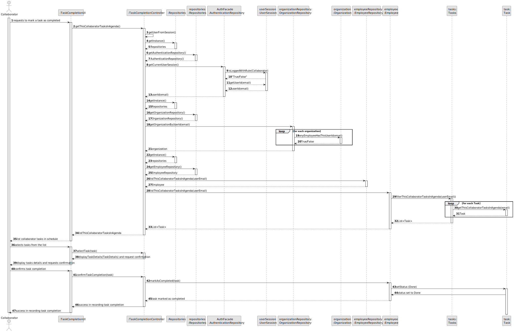
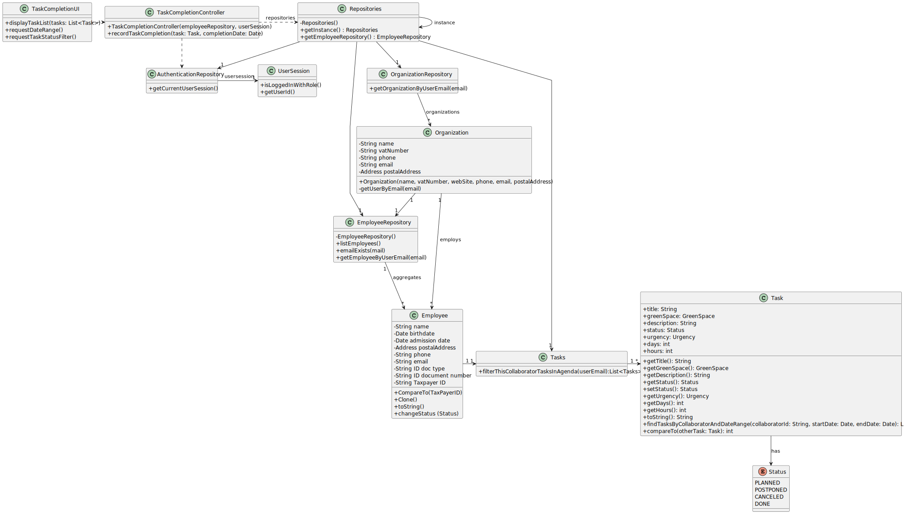

# US029 - As a Collaborator, I want to record the completion of a task.

## 3. Design - User Story Realization

### 3.1. Rationale

| Interaction ID                                                                         | Question: Which class is responsible for...                 | Answer                   | Justification (with patterns)                                                                       |
|:---------------------------------------------------------------------------------------|:------------------------------------------------------------|:-------------------------|:----------------------------------------------------------------------------------------------------|
| Step 1 - requests to mark a task as completed                                          | ... interacting with the actor?                             | TaskCompletionUI         | Pure Fabrication: there is no reason to assign this responsibility to any existing class in the DM. |
|                                                                                        | ... coordinating the US?                                    | TaskCompletionController | Controller: The controller is responsible for handling the user request and coordinating the use case.                                                   |
| Step 2 - list collaborator tasks in schedule                                           | ... displaying the list of tasks to the actor?                       | TaskCompletionUI                         | Pure Fabrication (Interaction with Actor)                                                             |
| Step 3 - selects tasks from the list                                                   | ... obtaining the collaborator's tasks in the schedule?                          | TaskCompletionController    | Controller: The controller coordinates obtaining the collaborator's tasks from the schedule.                                                            | 
| Step 4 - display tasks details and requests confirmation                               | ... displaying the task details and requesting confirmation?      | TaskCompletionUI    | Pure Fabrication (Interaction with Actor)                                                             |
| Step 5 - confirms task completion                                                      | ... validating task completion?               | TaskCompletionController               | Controller: The controller is responsible for validating and coordinating the task completion.                                     |
| Step 6 - success in recording task completion                                          | ... marking the task as completed?  | Employee               | IE: The Employee is responsible for marking the task as completed as they know its state and details.                                                                                 |
|                                                                                        | ... changing the task status to completed?| Task     | IE: The Task class knows and manages its own state, including the change to completed.                                                                        |
|                                                                                        | ... informing operation success?                            | TaskCompletionUI    | Pure Fabrication (Interaction with Actor)                                                              |              

### Systematization

According to the taken rationale, the conceptual classes promoted to software classes are: 

* Organization
* Employee
* Task 

Other software classes (i.e. Pure Fabrication) identified: 

* TaskCompletionUI
* TaskCompletionController 

## 3.2. Sequence Diagram (SD)

### Full Diagram

This diagram shows the full sequence of interactions between the classes involved in the realization of this user story.

## 3.3. Class Diagram (CD)

