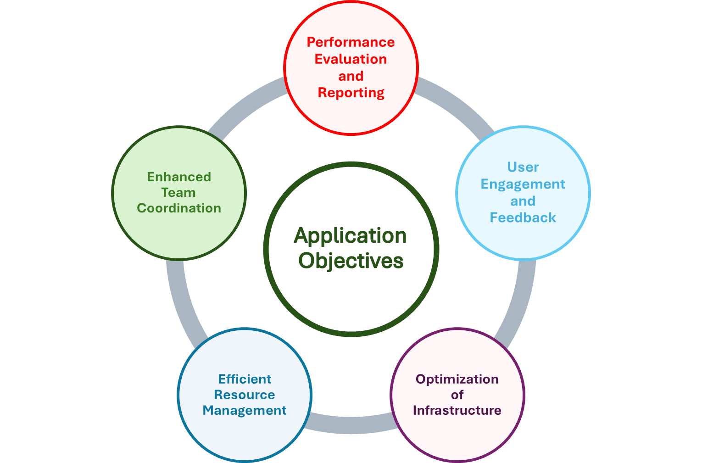

# User Manual

## Development of an Urban Green Spaces Management Software Solution

### Degree in Computer Engineering 
### LAPR2 – 2023/2024

Authors:
- Flávio Cruz (1010488)
- Pedro Morgado (1130277)
- Ricardo Teixeira (1181885)

Class: 1NB

Group: G322 (CodeGardeners)

Date: 11/04/2024

## Contents

- Glossary
- Introduction
- System Overview
- Features 
    

## [Glossary](01.requirements-engineering/glossary.md)

## Introduction

The purpose of this manual is to provide comprehensive guidance on
the utilization of the application, developed for the management of
urban parks. It aims to offer user clear instructions on navigating
and harnessing the full potential of the application's functionalities.

The application aims to optimize various aspects of park management,
including team coordination and management, resource allocation, generation of statistical reports,
and user communication. Therefore, it is a software product
specifically tailored to address the needs of park administrators,
maintenance personnel, and park users.

The manual is addressed to a diverse range of users involved in
the management and utilization of urban parks. These users may
include:

* **Park Administrators:** Individuals responsible for overseeing the
  planning, maintenance, and overall management of urban parks.

* **Maintenance Personnel:** Workers with responsibilities for maintenance activities within
  the park, such as gardening, landscaping, and infrastructure upkeep.

* **Park Users:** Individuals who visit and use the urban parks for
  recreational purposes. This may include families, joggers,
  picnickers, and other members of the community.

* **Technical Support Staff:** Personnel responsible for providing
  assistance and troubleshooting issues related to the application's
  usage and functionality.

## System Overview

The objectives of the application are aligned with addressing
needs associated with the management of urban parks.
Here are the primary objectives of the application, as seen also in figure 1:

1. **Enhanced Team Coordination:** The application facilitates
   effective coordination and communication among multi-professional
   teams involved in park maintenance activities. It provides tools
   for task assignment, scheduling, and collaboration, ensuring that
   teams work cohesively towards common objectives.

2. **Optimization of Infrastructure Systems:** One of the key objectives
   is to optimize infrastructure systems within urban parks, such as
   irrigation and lighting systems. The application offers
   functionalities to program and control these systems efficiently,
   ensuring optimal utilization of resources while minimizing waste.

3. **Performance Evaluation and Reporting:** Another objective is to
   enable park administrators to assess the performance of park
   management activities through the generation of statistical
   reports and performance indicators. These reports provide
   valuable insights into the effectiveness of maintenance
   efforts and help in making informed decisions for future planning.

4. **User Engagement and Feedback:** The application aims to foster
   greater engagement with park users by providing a dedicated
   portal for reporting faults or malfunctions of equipment. This
   feature allows park administrators to address issues promptly,
   thereby enhancing the overall user experience and satisfaction.

5. **Efficient Resource Management:** The application aims to streamline
   the allocation and utilization of resources within urban parks,
   including personnel, vehicles, machinery, and equipment.
   By optimizing resource allocation, the application helps in
   enhancing operational efficiency and reducing costs.

By achieving these objectives, the application contributes to
the effective and sustainable management of urban parks,
ultimately enhancing the quality of life for park users and
communities.

*Figure 1 - Primary objectives of the application*

# Features

| **Number** | **Functionality**                           | Description                                                                                                                | User                            |
|------------|---------------------------------------------|----------------------------------------------------------------------------------------------------------------------------|---------------------------------|
| **1**      | **Register a skill**                        | Create a skill by selecting functionality and inserting asked data.                                                        | Human Resources Manager(HRM)    |
| **2**      | **Register a job**                          | Create a job by selecting functionality and inserting asked data.                                                          | Human Resources Manager(HRM)    |
| **3**      | **Register a collaborator**                 | Create a collaborator by selecting functionality and inserting asked data ans choosing a Job from a list.                  | Human Resources Manager(HRM)    |
| **4**      | **Assign skills to a collaborator**         | Selecting functionality to choose a collaborator and assign one or more skills from a list.                                | Human Resources Manager(HRM)    |
| **5**      | **Generate a team automatically**           | Selecting this functionality a team will be created with skills and number of collaboratores inserted                      | Human Resources Manager(HRM)    |
| **6**      | **Register a vehicle**                      | Create a vehicle by selecting functionality and inserting asked data.                                                      | Vehicle Fleet Manager(VFM)      |
| **7**      | **Register vehicle maintenance**            | Selecting this functionality will be asked by maintenance data and update that information.                                | Vehicle Fleet Manager(VFM)      |
| **8**      | **List vehicles needing maintenance**       | Functionality that lists vehicles that need maintenance appointment.                                                       | Vehicle Fleet Manager(VFM)      |
| **9**      | **Water consumption costs in Green Spaces** | Functionality that calculates water consumption costs reading a file given by GSM with water consumptions.                 | Green Spaces Manager(GSM)       |
| **10**     | **Equipment Use**                           | Creates a pie chart with percentages of used of a Green Space inputing a file with individual equipment uses.              | Green Spaces Manager(GSM)       |
| **11**     | **Park Use by age**                         | Generate a graph age organized with park uses and if is reccommended to other users with a inputted PortalUser information | Green Spaces Manager(GSM)       |
| **12**     | **Import "csv" file**                       | Data import from a file that cointains water points connections and associated distance                                    | Green Spaces Manager(GSM)       |
| **13**     | **Create water route**                      | Functionality that returns the routes to be opened and pipes needed to be laid with a minimum accumulated cost             | Green Spaces Manager(GSM)       |
| **14**     | **Execution time tests**                    | This action runs a series of tests to see how inputs affects execution times in a algorithm                                | Quality Assurance Manager (QAM) |
