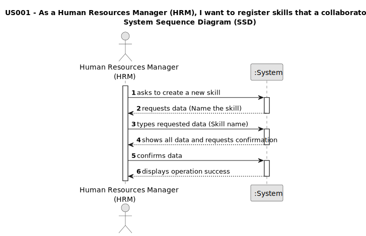

# US001 - Register skills that may be appointed to a collaborator

## 1. Requirements Engineering

### 1.1. User Story Description

_As a Human Resources Manager (HRM), I want to register skills that a collaborator may have_

### 1.2. Customer Specifications and Clarifications 

**From the specifications document:**

_The skills must be clearly defined and described._

_Options of add, edit and delete skills must be defined._

_It must be easy visualize the skills of each collaborator._

_Skills must be linked to the individual profile of each employee._

**From the client clarifications:**

> **Question:** "What should the system do when a skill that already exists is created?"
>
> **Answer:** "By definition, it's not possible to have duplicate values in a set. Checking for duplicates is not a business rule; it's a technical-level requirement."

> **Question:** "Which are the skills accepted? Or should we enable the HRM to introduce anything as a skill?"
>
> **Answer:** "All, it's up to HRM to decide. (special characters or algarisms should not be allowed in the skill name)"

### 1.3. Acceptance Criteria

_AC1 - A skill name can’t have special characters or digits._

_AC2 - Skills can be registered and appointed to collaborator by the HRM._

_AC3 - Every skills must be registered._

_AC4 - Identify skills names._

### 1.4. Found out Dependencies

_"US04 - As an HRM, I want to assign one or more skills to a collaborator." depends on this US01, because it is on this one that skills are registered._

### 1.5 Input and Output Data

Input:

Typed data: Skill.

Output - List of collaborator's skills.

### 1.6. System Sequence Diagram (SSD)

### 1.7 Other Relevant Remarks

_Maintain skills up to date to ensure accuracy of workers' skills.
 The system must handle the introduction of input errors, and process as invalid data.
 Users must be given an adequate explanation of how the program works._

