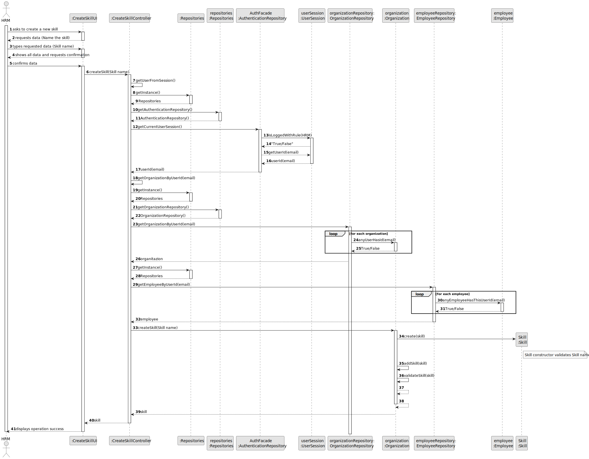
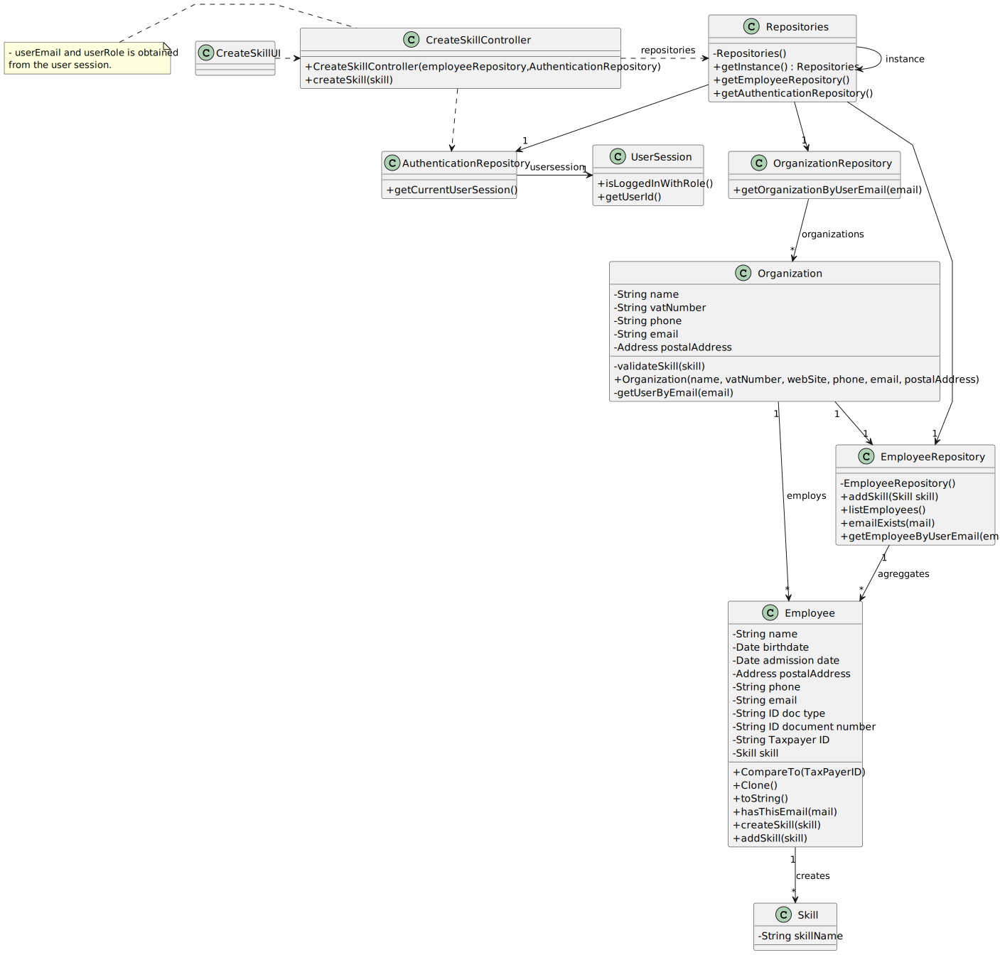

# US001 - As a HRM, I want to register skills that may be appointed to a collaborator.

## 3. Design - User Story Realization 

### 3.1. Rationale

| Interaction ID                             | Question: Which class is responsible for...                 | Answer                | Justification (with patterns)                                                                       |
|:-------------------------------------------|:------------------------------------------------------------|:----------------------|:----------------------------------------------------------------------------------------------------|
| Step 1 - asks to create a new skill		  | ... interacting with the actor?                             | CreateSkillUI         | Pure Fabrication: there is no reason to assign this responsibility to any existing class in the DM. |
|                                            | ... coordinating the US?                                    | CreateSkillController | Pure Fabrication(System Interaction Controller)                                                     |
| Step 2 - requests data (Name the skill)    | ... displaying form for actor input?                        | CreateSkillUI         | Pure Fabrication(Interation with Actor)                                                             |
| Step 3 - types requested data (Skill name) | ... temporaly keeping input data?                           | CreateSkillUI         | Pure Fabrication(Interation with Actor)                                                             | 
| Step 4 - shows all data and requests confirmation | ... displaying all the information before submitting?       | CreateSkillUI         | Pure Fabrication(Interation with Actor)                                                             |
| Step 5 - confirms data			          | ... knowing the user using the system?                      | UserSession           | IE: see Auth component documentation.                                                               |        
| 	                                          | ... instantiating a new Skill (Object)?                     | Organization          | Creator (Rule 1): in the DM Organization owns Skills list.                                          |
|   		                                  | ... validating all data (local validation,i.e.mandatory)?   | Skill                 | IE: owns its data.                                                                                  |
| 		                                      | ... validating all data (global validation,i.e.duplicates)? | Organization          | IE: knows all its skills.                                                                           |
| 			  		                          | ... saving the created skill?                               | Organization          | IE: owns all its skills.                                                                            |
| 		                                      | ... saving the inputted data?                               | Skill                 | IE: object created previously has its own data.                                                     |
| Step 6 - displays operation success	  	  | ... information operation sucess?                           | CreateSkillUI         | PureFabrication(Interation with Actor)                                                              |              

### Systematization ##

According to the taken rationale, the conceptual classes promoted to software classes are: 

* Organization
* Employee
* Skill

Other software classes (i.e. Pure Fabrication) identified: 

* CreateSkillUI
* CreatSkillController

## 3.2. Sequence Diagram (SD)

### Full Diagram

This diagram shows the full sequence of interactions between the classes involved in the realization of this user story.

## 3.3. Class Diagram (CD)

