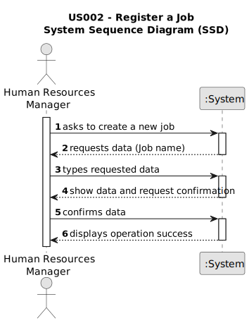

# US002 - As an HRM, I want to register a job.

## 1. Requirements Engineering

### 1.1. User Story Description

As a Human Resources Manager in the organization, I want to register a job that defines main occupation of an employee.

### 1.2. Customer Specifications and Clarifications 

**From the specifications document:**

The main occupation of employees such as designer, estimator, gardener, electrician, or mason, being inputted by the HRM.

**From client meeting:**

Client clarification, just a Job Name insertion is needed.

### 1.3. Acceptance Criteria

**AC1** - A job name can’t have special characters or digits.

**AC2** - Required field (name) filled with at least one word.

**AC3** - Only HRM can create a Job.

### 1.4. Found out Dependencies

None.

### 1.5 Input and Output Data

**Input Data:** 
* Typed data: 
  * Name

**Output Data:**

* (In)Success of the operation

### 1.6. System Sequence Diagram (SSD)

### 1.7 Other Relevant Remarks

Only a job is created, is not assigned to any employee in this US.

  

