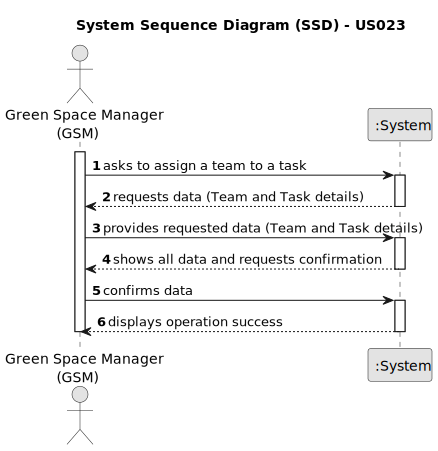

# US23 - As a GSM, I want to assign a Team to an entry in the Agenda

## 1. Requirements Engineering

### 1.1. User Story Description
As a GSM, I want to assign a Team to an entry in the Agenda

### 1.2. Customer Specifications and Clarifications 

**From the specifications document:**

> The Agenda is made up of entries that relate to a task (which was previously in the To-Do List), the team that will carry out the task, the vehicles/equipment assigned to  the task, expected duration, and the status (Planned, Postponed, Canceled, Done).

### 1.3. Acceptance Criteria

* **AC1:** A message must be sent to all team members informing them about the assignment
* **AC2:** Different email services can send the message. These services must be defined through a configuration file to allow the use of different platforms (e.g. Gmail, DEI’s email service, etc.)

### 1.4. Found out Dependencies

* US23 depends on the US05, first we must create a team in order to assign to the agenda.

### 1.5 Input and Output Data

**Input Data:**
* Selected data
  * Tasks
  * Team

**Output Data:**
* (In)Success of the operation

### 1.6. System Sequence Diagram (SSD)

### 1.7 Other Relevant Remarks
[N/A]