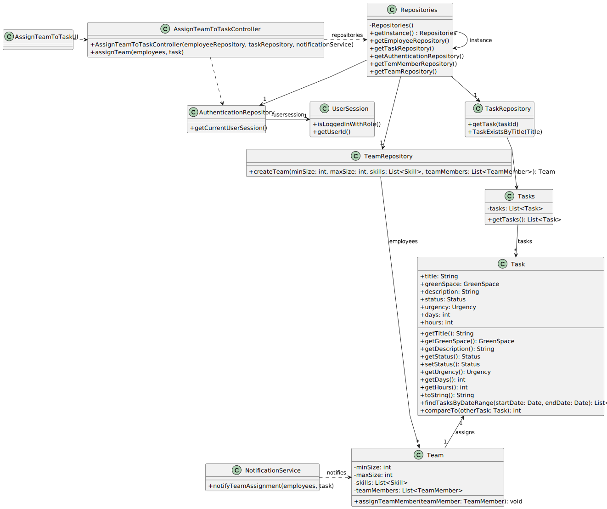

# US23 - As a GSM, I want to assign a Team to an entry in the Agenda

## 3. Design - User Story Realization 

### 3.1. Rationale

| InteractionID                                       | Question: Which class is responsible for…                 | Answer                     | Justification (with patterns)                             |
|-----------------------------------------------------|-----------------------------------------------------------|----------------------------|-----------------------------------------------------------|
| Step 1 - Ask to Assign a Team to a Task             | … interacting with the actor?                            | AssignTeamToTaskUI         | Pure Fabrication                                          |
|                                                     | … Coordinating the US?                                    | AssignTeamToTaskController | Pure Fabrication (System Interaction Controller)          |
| Step 2 - Requests Data                              | … displaying form for actor input?                        | AssignTeamToTaskUI         | Pure Fabrication (Interaction with actor)                 |
| Step 3 - Provides Requested Data                    | … Validating input data?   temporarily keeping input data | AssignTeamToTaskUI         | Pure Fabrication (Interaction with actor)                 |
| Step 4 - Shows All Data and Requests Confirmation   | … displaying all the information before submitting?       | AssignTeamToTaskUI         | Pure Fabrication (Interaction with actor)                 |
|                                                     | … validating all data? (Local validation, i.e. mandatory) | Team                       | IE: owns its data                                         |
|                                                     | … validating all data? (Global validation, i.e. duplicates)| Task                       | IE: knows all its assignments                             |
|                                                     | … saving the created assignment?                          | Task                       | IE: owns its data                                         |
| Step 6 - Display Operation Success                  | … information on operation success?                      | AssignTeamToTaskUI         | Pure Fabrication (Interaction with Actor)                 |

### Systematization ##

According to the taken rationale, the conceptual classes promoted to software classes are:

* Team; Task

Other software classes (i.e. Pure Fabrication) identified:

* AssignTeamToTaskUI
* AssignTeamToTaskController

## 3.2. Sequence Diagram (SD)

_**Note that SSD - Alternative Two is adopted.**_

### Full Diagram

This diagram shows the full sequence of interactions between the classes involved in the realization of this user story.

## 3.3. Class Diagram (CD)

