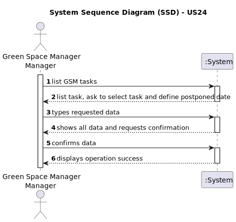

# US24 - Postpone an entry in the Agenda

## 1. Requirements Engineering

### 1.1. User Story Description
As a GSM, I want to Postpone an entry in the Agenda to a specific future date

### 1.2. Customer Specifications and Clarifications 

**From the specifications document:**

> The agenda are made of entries and each entry is made of, among others, its status (Planned, Postponed, and Done)

> Only GSM is authorized edit the status field;

**From the client clarifications:**

[//]: # (https://moodle.isep.ipp.pt/mod/forum/discuss.php?d=29753#p37717)
> **Question:** What are the input to postpone an entry?
> 
> From my perspective the Green Spaces Manager only needs to select the entry and introduce the new date.
>
> **Answer:** Yes, you are correct!

### 1.3. Acceptance Criteria

* **AC1:** Allows the GSM to postpone an entry in the agenda.
* **AC2:** The entry date must be later than the current date.
* 
[//]: # (* **AC3:**)

### 1.4. Found out Dependencies

* US24 depends on the US05, first we must create a team in order to assign to the agenda.

### 1.5 Input and Output Data

**Input Data:**
* Selected data
  * Entry 
* Typed data
  * Date

**Output Data:**
* (In)Success of the operation

### 1.6. System Sequence Diagram (SSD)

### 1.7 Other Relevant Remarks
[N/A]