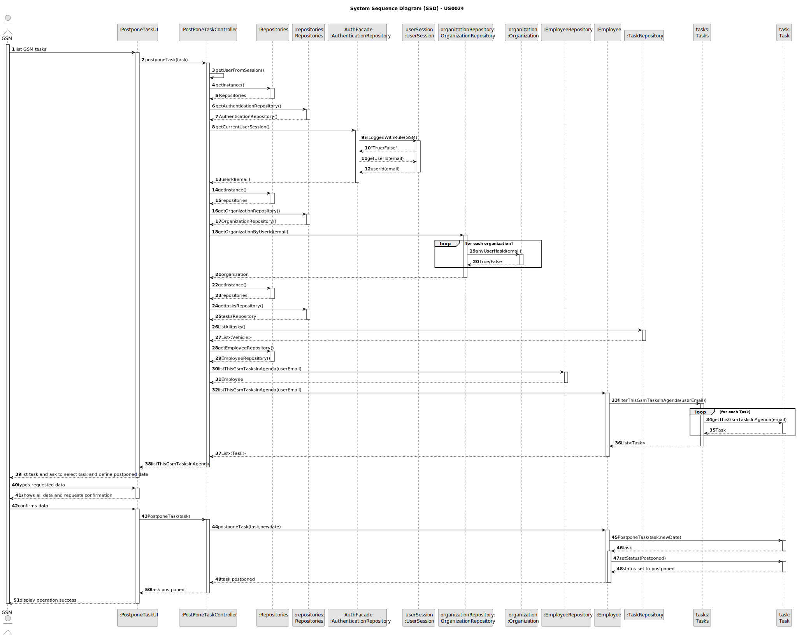
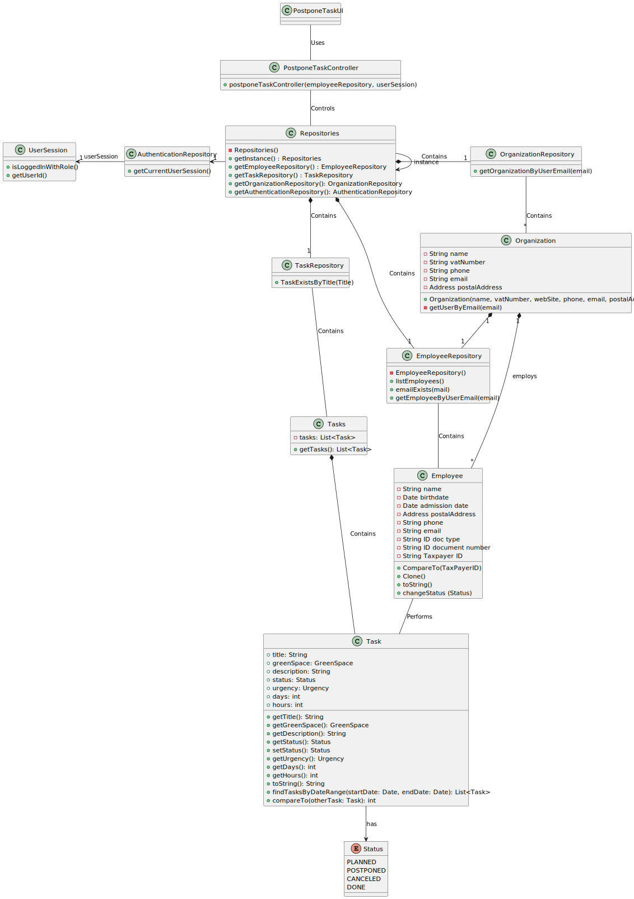

# US24 - Postpone an entry in the Agenda

## 3. Design - User Story Realization 

### 3.1. Rationale

| InteractionID                                                    | Question: Which class is responsible for…                   | Answer                 | Justification (with patterns)                    |
|------------------------------------------------------------------|-------------------------------------------------------------|------------------------|--------------------------------------------------|
| Step 1 - list GSM tasks                                          | … interacting with the actor?                               | PostponeTaskUI         | Pure Fabrication                                 |
|                                                                  | … Coordinating the US?                                      | PostponeTaskController | Pure Fabrication (System Interaction Controller) |
|                                                                  | … knowing the user using the system?                        | UserSession            | IE: see Auth component documentation.            |
| Step 2 - list task, ask to select task and define postponed date | … displaying list for actor input selection?                | PostponeTaskUI         | Pure Fabrication (Interaction with actor)        |
|                                                                  | … knowing the tasks to show?                                | Employee               | IE: knows all tasks.                             |
| Step 3 - Types Requested Data                                    | … temporally keeping input data?                            | PostponeTaskUI         | Pure Fabrication (Interaction with actor)        |
| Step 4 - Shows all data and requests Confirmation                | … displaying all the information before submitting?         | PostponeTaskUI         | Pure Fabrication (Interaction with actor)        |
|                                                                  | … validating all data? (Local validation, i.e. mandatory)   | Task                   | IE: owns its data                                |
|                                                                  | … validating all data? (Global validation, i.e. duplicates) | Employee               | IE: knows all its tasks                          |
|                                                                  | … Saving the inputted data?                                 | Task                   | IE: object created previously                    |
| Step 6 - Display operation Success                               | … information on operation success?                         | PostponeTaskUI         | Pure Fabrication (Interaction with Actor)        |

### Systematization ##

According to the taken rationale, the conceptual classes promoted to software classes are:

* Employee
* Task

Other software classes (i.e. Pure Fabrication) identified:

* PostponeTaskUI
* PostponeTaskController

## 3.2. Sequence Diagram (SD)

### Full Diagram

This diagram shows the full sequence of interactions between the classes involved in the realization of this user story.

## 3.3. Class Diagram (CD)

