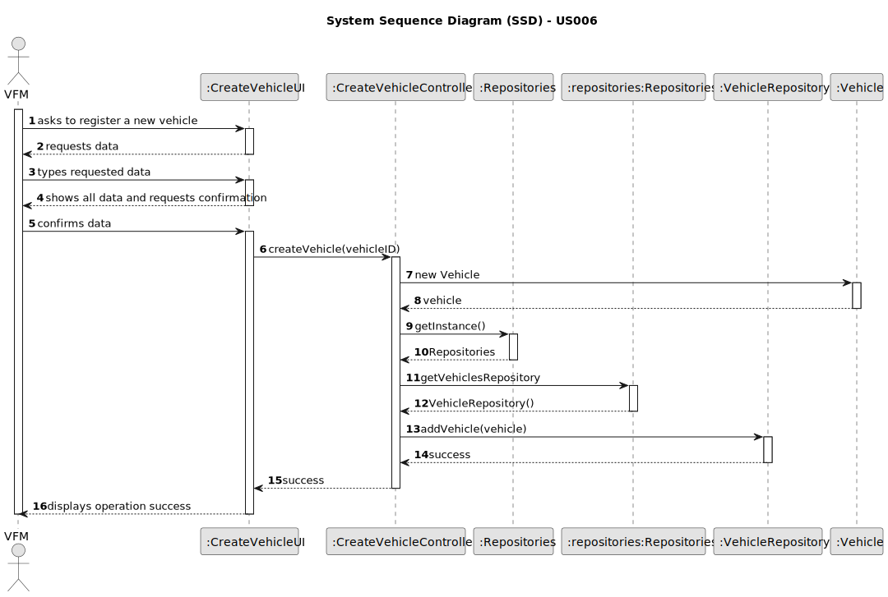
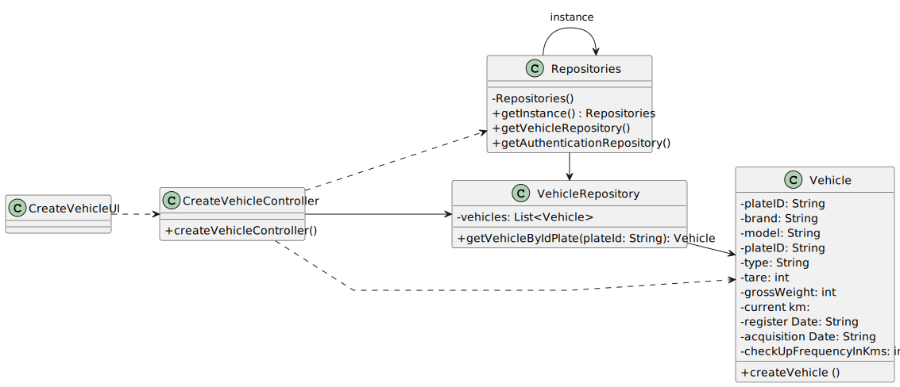

# US24 - Postpone an entry in the Agenda

## 3. Design - User Story Realization 

### 3.1. Rationale

| Interaction ID                             | Question: Which class is responsible for...                 | Answer                   | Justification (with patterns)                                                                       |
|:-------------------------------------------|:------------------------------------------------------------|:-------------------------|:----------------------------------------------------------------------------------------------------|
| Step 1 - requests to add a new To-Do List entry | ... interacting with the actor?                             | ToDoListUI               | Pure Fabrication: there is no reason to assign this responsibility to any existing class in the DM. |
|                                            | ... coordinating the US?                                    | ToDoListController       | Pure Fabrication (System Interaction Controller)                                                     |
|                                            | ... knowing the user using the system?                      | UserSession              | IE: see Auth component documentation.                                                               |        
| Step 2 - requests data                                         | ... displaying form for actor input?                        | ToDoListUI               | Pure Fabrication (Interaction with Actor)                                                             |
| Step 3 - types requested data                                  | ... temporally keeping input data?                          | ToDoListUI               | Pure Fabrication (Interaction with Actor)                                                             |
| Step 4 - show To-Do List entry data and request confirmation   | ... displaying all the information before submitting?       | ToDoListUI               | Pure Fabrication (Interaction with Actor)                                                             |
| Step 5 - confirms data                                         | ... instantiating a new Task (Object)?                      | Task                     | Creator (Rule 1): in the DM Task owns its data.                                                     |
|                                                                | ... validating all data (local validation,e.g. mandatory)?  | Task                     | IE: owns its data.                                                                                  |
|                                                                | ... validating all data (global validation, e.g., duplicates)?| TaskRepository           | IE: knows all Tasks.                                                                               |
|                                                                | ... saving the To-Do List entry?                            | TaskRepository           | IE: owns all Tasks.                                                                                |
| Step 6 - display operation success                             | ... informing operation success?                            | ToDoListUI               | Pure Fabrication (Interaction with Actor) |

[//]: # (| InteractionID                                        | Question: Which class is responsible for…                 | Answer             | Justification &#40;with patterns&#41;                             |)

[//]: # (|------------------------------------------------------|-----------------------------------------------------------|--------------------|-----------------------------------------------------------|)

[//]: # (| Step 1 - Asks to postpone an entry                   | … interacting with the actor?                            | PostponeTaskUI     | Pure Fabrication                                          |)

[//]: # (|                                                      | … Coordinating the US?                                    | PostponeTaskController | Pure Fabrication &#40;System Interaction Controller&#41;          |)

[//]: # (|                                                       |… knowing the user using the system?                       | UserSession       | IE: see Auth component documentation.                     |)
[//]: # (| Step 2 - Requests data &#40;i.e. TaskId, postponed date&#41; | … displaying form for actor input?                        | PostponeTaskUI     | Pure Fabrication &#40;Interaction with actor&#41;                 |)

[//]: # (| Step 3 - Types Requested Data                        | … temporally keeping input data?                          | PostponeTaskUI     | Pure Fabrication &#40;Interaction with actor&#41;                 |)

[//]: # (| Step 4 - Shows all data and requests Confirmation    | … displaying all the information before submitting?       | PostponeTaskUI   | Pure Fabrication &#40;Interaction with actor&#41;                 |)
| Step 5 - Confirms data                               | … instantiating a new Vehicle (Object)?                    | Vehicle            | IE: owns its data                                         |
|                                                      | … validating all data? (Local validation, i.e. mandatory)  | Vehicle            | IE: owns its data                                         |
|                                                      | … validating all data? (Global validation, i.e. duplicates)| Vehicle            | IE: knows all its Vehicles                                |
|                                                      | … saving the created Vehicle?                              | Vehicle            | IE: owns its data                                         |
|                                                      | … Saving the inputted data?                                | Vehicle            | IE: object created previously has its own data            |
| Step 6 - Display operation Success                   | … information on operation success?                        | Create VehicleUI   | Pure Fabrication (Interaction with Actor)                 |

### Systematization ##

According to the taken rationale, the conceptual classes promoted to software classes are:

* Vehicle

Other software classes (i.e. Pure Fabrication) identified:

* CreateVehicleUI
* CreateVehicleController

## 3.2. Sequence Diagram (SD)

_**Note that SSD - Alternative Two is adopted.**_

### Full Diagram

This diagram shows the full sequence of interactions between the classes involved in the realization of this user story.

## 3.3. Class Diagram (CD)

