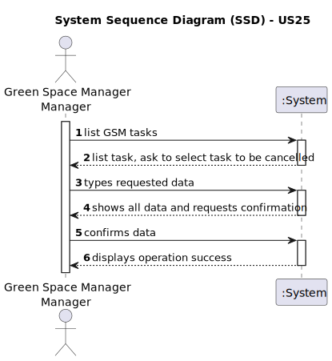

# US25 - Cancel an entry in the Agenda

## 1. Requirements Engineering

### 1.1. User Story Description
As a GSM, I want to Cancel an entry in the Agenda.

### 1.2. Customer Specifications and Clarifications 

**From the specifications document:**

> The agenda are made of entries and each entry is made of, among others, its status (Planned, Postponed, Canceled, and Done)

> Only GSM is authorized edit the status field;

[//]: # (**From the client clarifications:**)

### 1.3. Acceptance Criteria

* **AC1:** Allows the GSM to cancel a task in the agenda.
* **AC2:** After cancelling the task, it must change the status to "cancelled"
* **AC3:** A canceled task should not be deleted but rather change its
  state. 

### 1.4. Found out Dependencies

* US25 depends on US05; first, we must create a team in order to assign it to the agenda
* US25 depends on US22, which creates a task

### 1.5 Input and Output Data

**Input Data:**
* Selected data
  * Task

**Output Data:**
* (In)Success of the operation

### 1.6. System Sequence Diagram (SSD)

### 1.7 Other Relevant Remarks
[N/A]