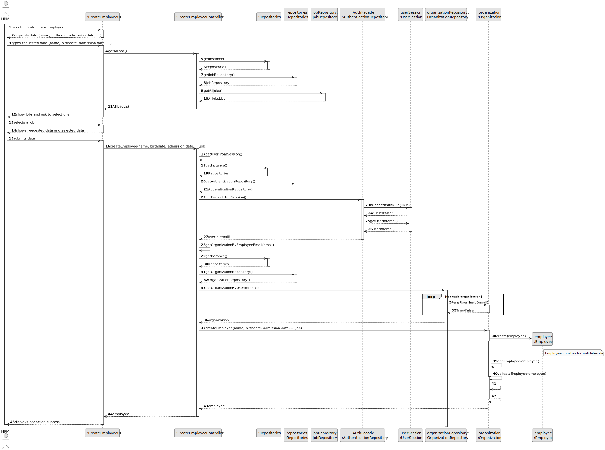
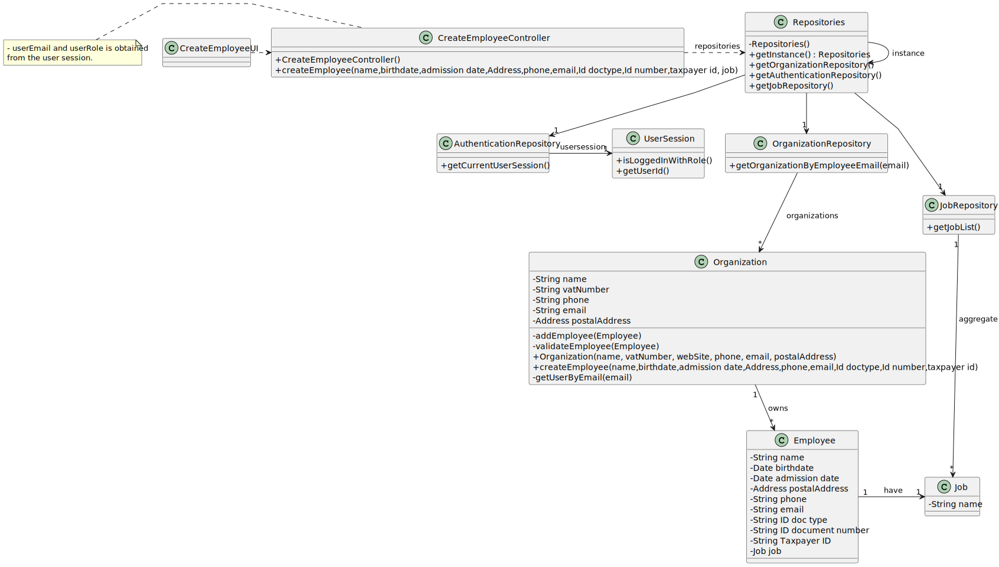

# US003 - As an HRM, I want to register a collaborator with a job and fundamental characteristics.

## 3. Design - User Story Realization 

### 3.1. Rationale

| Interaction ID                               | Question: Which class is responsible for...                 | Answer                   | Justification (with patterns)                                                                       |
|:---------------------------------------------|:------------------------------------------------------------|:-------------------------|:----------------------------------------------------------------------------------------------------|
| Step 1 - ask to create a new collaborator    | ... interacting with the actor?                             | CreateEmployeeUI         | Pure Fabrication: there is no reason to assign this responsibility to any existing class in the DM. |
|                                              | ... coordinating the US?                                    | CreateEmployeeController | Controller                                                                                          |
| 			                                    | ... knowing the user using the system?                      | UserSession              | IE: see Auth component documentation.                                                               |        
| Step 2 - requests data                       | ... displaying form for actor input?                        | CreateEmployeeUI         | Pure Fabrication(Interation with Actor)                                                             |
| Step 3 - types requested data                | ... temporaly keeping input data?                           | CreateEmployeeUI         | Pure Fabrication(Interation with Actor)                                                             | 
| Step 4 - show job list and request selection | ...knowing the jobs to show?                                | Organization             | IE: knows all Jobs.                                                                                 |
| Step 5 - select job                          | ...saving th selected job?                                  | CreateEmployeeUI         | Pure Fabrication(Interation with Actor)                                                             |
| Step 6 - show data an request confirmation   | ... displaying all the information before submitting?       | CreateEmployeeUI         | Pure Fabrication(Interation with Actor)                                                             |
| Step 7 - confirms data                       | ... instantiating a new Employee (Object)?                  | Organization             | Creator (Rule 1): in the DM Organization owns Employees list.                                       |
| 		                                        | ... validating all data (local validation,e.g. mandatory)?  | Employee                 | IE: owns its data.                                                                                  |
| 		                                        | ... validating all data (global validation,e.g.duplicates)? | Organization             | IE: knows all its Employees.                                                                        |
| 			  		                            | ... saving the created employee?                            | Organization             | IE: owns all its Employees.                                                                         |
| 		                                        | ... saving the inputted data?                               | Employee                 | IE: object created previously has its own data.                                                     |
| Step 8 - display operation success	         | ... information operation sucess?                          | CreateEmployeeUI         | PureFabrication(Interation with Actor)                                                              |              

### Systematization ##

According to the taken rationale, the conceptual classes promoted to software classes are: 

* Organization
* Employee

Other software classes (i.e. Pure Fabrication) identified: 

* CreateCollaboratorUI  
* CreateCollaboratorController

## 3.2. Sequence Diagram (SD)

### Full Diagram

This diagram shows the full sequence of interactions between the classes involved in the realization of this user story.

## 3.3. Class Diagram (CD)

