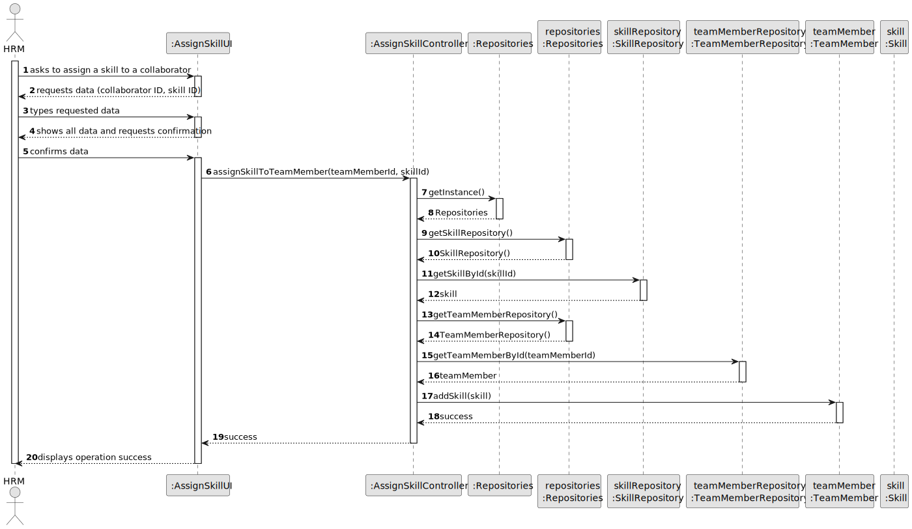
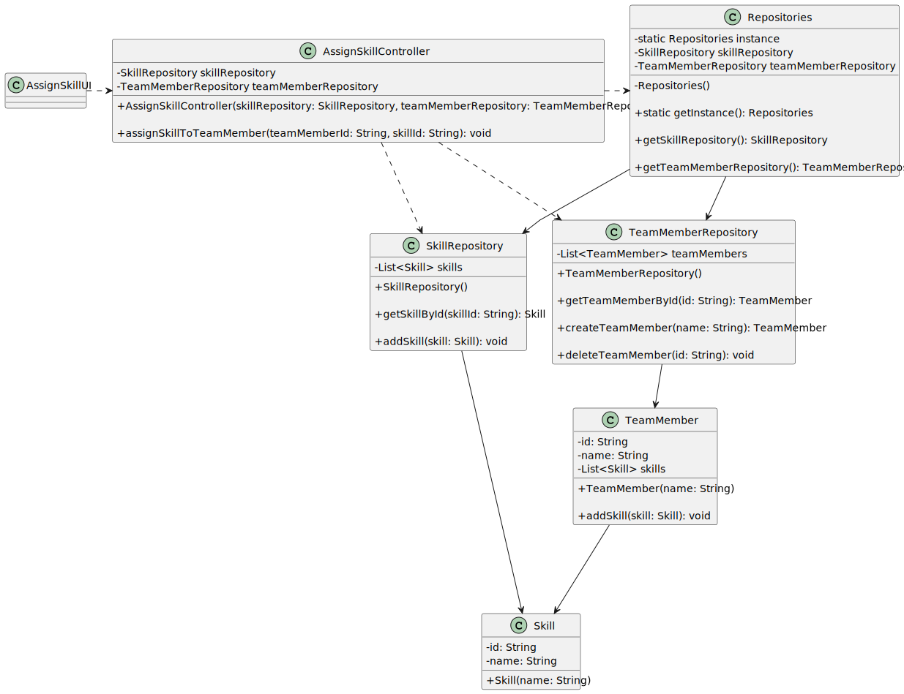

# US004 - As an HRM, I want to assign one or more skills to a collaborator.

## 3. Design - User Story Realization 

### 3.1. Rationale

| Interaction ID                                         | Question: Which class is responsible for...                  | Answer                | Justification (with patterns)                                                                                    |
|:-------------------------------------------------------|:-------------------------------------------------------------|:----------------------|:-----------------------------------------------------------------------------------------------------------------|
| Step 1 - List for a collaborator available	            | ... interacting with the actor?                              | AssignSkillUI         | Pure Fabrication: there is no reason to assign this responsibility to any existing class in the DM.                |
|                                                        | ... coordinating the US?                                     | AssignSkillController | Controller: The controller is responsible for handling the user request and coordinating the use case.           |
| Step 2 - Shows list of collaborators                   | ... displaying form for actor input?                         | AssignSkillUI         | Pure Fabrication(Interation with Actor)                                                                          |
| Step 3 - Choose collaborator                           | ... temporaly keeping input data?                            | AssignSkillController | IE: The controller has the necessary information and is responsible for temporarily storing the input data.      | 
| Step 4 - Shows skills list, asks to select one or more | ... displaying all the information before submitting?        | AssignSkillUI         | Pure Fabrication(Interation with Actor).                                                                         |
| Step 5 - Selects one or more skills			                 | ... knowing the user using the system?                       | AssignSkillUI         | IE: The UI class interacts with the user and knows the user using the system.                                    |
| Step 6 - Shows all data and requests confirmation 		   | ... displaying form for actor input?    | AssignSkillUI                 | Pure Fabrication(Interation with Actor)                 |
| Step 7 -Confirms collaborator and skill assigned	      | ... validating all data (local validation,i.e.mandatory)?    | Employee              | IE: owns its data.                                                                                               |     
|                                                        | ... validating all data (global validation,i.e.duplicates)?	 | Organization          | IE: knows all its Employees.                                                                                     |
| 		                                                     | ... saving the assign skill?                                 | AssignSkillController | IE: owns the skills assign.                                                                                      |
|                                                        | ... saving the inputted data?                                | Employee              | IE: previously assigned from assign skills.                                                                      |
| Step 8 - Displays operation success	                   | ... information operation success?                           | AssignSkillUI         | Pure Fabrication (Interation with Actor)                                                                                                |
### Systematization ##

According to the taken rationale, the conceptual classes promoted to software classes are: 

* Organization 
* Team Member
* Skill

Other software classes (i.e. Pure Fabrication) identified: 

*  AssignSkillUI
* AssignSkillController 

## 3.2. Sequence Diagram (SD)

### Full Diagram

This diagram shows the full sequence of interactions between the classes involved in the realization of this user story.

## 3.3. Class Diagram (CD)

