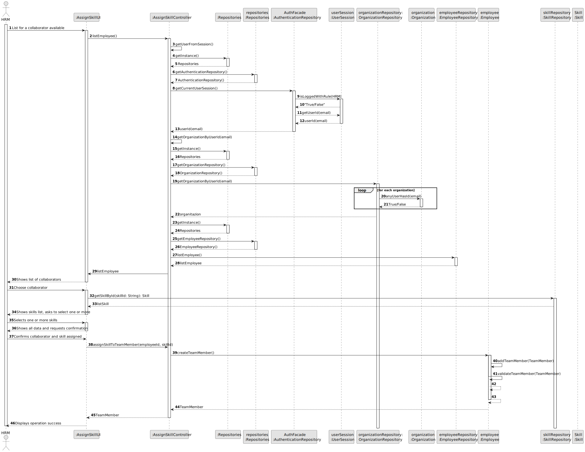
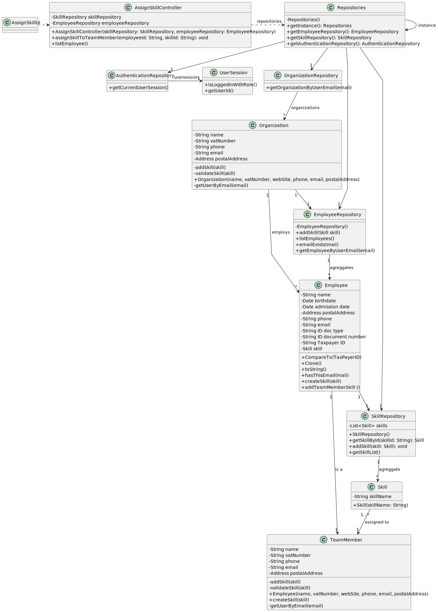

# US004 - As an HRM, I want to assign one or more skills to a collaborator.

## 3. Design - User Story Realization 

### 3.1. Rationale

| Interaction ID                                         | Question: Which class is responsible for...                  | Answer                | Justification (with patterns)                                                                                    |
|:-------------------------------------------------------|:-------------------------------------------------------------|:----------------------|:-----------------------------------------------------------------------------------------------------------------|
| Step 1 - List for a collaborator available	            | ... interacting with the actor?                              | AssignSkillUI         | Pure Fabrication: The UI class is created to interact with the user and get the necessary inputs.                |
|                                                        | ... coordinating the US?                                     | AssignSkillController | Controller: The controller is responsible for handling the user request and coordinating the use case.           |
| Step 2 - Shows list of collaborators                   | ... displaying form for actor input?                         | AssignSkillUI         | Pure Fabrication: The UI class is responsible for displaying the form and getting the input from the user.       |
| Step 3 - Choose collaborator                           | ... temporaly keeping input data?                            | AssignSkillController | IE: The controller has the necessary information and is responsible for temporarily storing the input data.      | 
| Step 4 - Shows skills list, asks to select one or more | ... displaying all the information before submitting?        | AssignSkillUI         | Pure Fabrication: The UI class is responsible for displaying all the information before submitting.              |
| Step 5 - Selects one or more skills			                 | ... knowing the user using the system?                       | AssignSkillUI         | IE: The UI class interacts with the user and knows the user using the system.                                    |        
| 	                                                      | ... instantiating a new Skill (Object)?                      | Skill                 | Creator: The Skill class is responsible for creating a new Skill object as it has the necessary information.     |
| Step 6 - Shows all data and requests confirmation 		   | ... validating all data (local validation,i.e.mandatory)?    | Skill                 | IE: The Skill class has the necessary information and is responsible for validating the data.                    |
| 		                                                     | ... validating all data (global validation,i.e.duplicates)?  | SkillRepository       | IE: The SkillRepository class has the necessary information and is responsible for validating the data globally. |
|                                                        | ... saving the created skill?                                | SkillRepository       | IE: The SkillRepository class has the necessary information and is responsible for saving the created skill.     |
| 		                                                     | ... saving the inputted data?                                | SkillRepository       | IE: The SkillRepository class has the necessary information and is responsible for saving the inputted data.     |
| Step 7 -Confirms collaborator and skill assigned	      | ... validating all data (local validation,i.e.mandatory)?    | Skill                 | IE:  The Skill class has the necessary information and is responsible for validating the data.                   |     
|                                                        | ... validating all data (global validation,i.e.duplicates)?	 | SkillRepository    | IE: The SkillRepository class has the necessary information and is responsible for validating the data globally.     |
| 		                                                     | ... saving the created skill?                                | SkillRepository       | IE: The SkillRepository class has the necessary information and is responsible for saving the created skill.    |
|                                                        | ... saving the inputted data?                                | SkillRepository       | IE: The SkillRepository class has the necessary information and is responsible for saving the inputted data.    |
| Step 8 - Displays operation success	                   | ... information operation success?                           | AssignSkillUI         | IE: Pure Fabrication: The UI class is responsible for displaying the operation success message.    |
### Systematization ##

According to the taken rationale, the conceptual classes promoted to software classes are: 

* Team Member
* Skill

Other software classes (i.e. Pure Fabrication) identified: 

*  AssignSkillUI
* AssignSkillController 

## 3.2. Sequence Diagram (SD)

### Full Diagram

This diagram shows the full sequence of interactions between the classes involved in the realization of this user story.

## 3.3. Class Diagram (CD)

