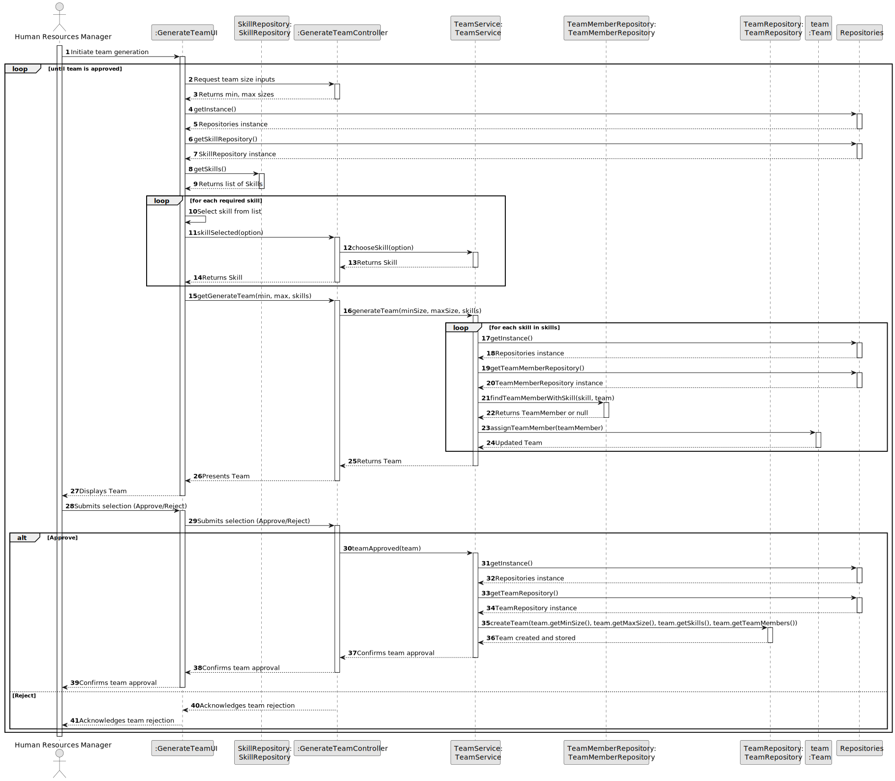

# US005 - Generate a Team

## 3. Design - User Story Realization

### 3.1. Rationale

| Interaction ID | Question: Which class is responsible for... | Answer                 | Justification (with patterns)                                                                                 |
|----------------|--------------------------------------|------------------------|---------------------------------------------------------------------------------------------------------------|
| Step 1         | ... interacting with the actor?      | GenerateTeamUI         | Pure Fabrication: there is no reason to assign this responsibility to any existing class in the Domain Model. |
|                | ... coordinating the US?             | GenerateTeamController | Controller: Manages the user input and coordinates the team generation process.                               |
|                | ... knowing the skills to show       | SkillRepository        | Pure Fabrication: technical abstraction that facilitates skills management.                                   |
| Step 2         | ... knowing the skills of each TeamMember | TeamMemberRepository   | Pure Fabrication: technical abstraction that facilitates collaborators/team members management.               |
| Step 3         | ... validating all data (local validation)? | Team                   |                                                                                                               |
| Step 4         | ... saving the created team?         | TeamRepository         | Pure Fabrication: Class responsible for saving Team.                                                          |
| Step 6         | ... informing operation success?     | GenerateTeamUI         |                                                                                                               |

### Systematization

According to the taken rationale, the conceptual classes promoted to software classes are:

- Team

Other software classes (i.e., Pure Fabrication) identified:

- GenerateTeamUI
- GenerateTeamController
- TeamService
- TeamMemberRepository
- TeamRepository
- SkillRepository

## 3.2. Sequence Diagram (SD)

### Full Diagram

This diagram shows the full sequence of interactions between the classes involved in the realization of this user story

## 3.3. Class Diagram (CD)

`
