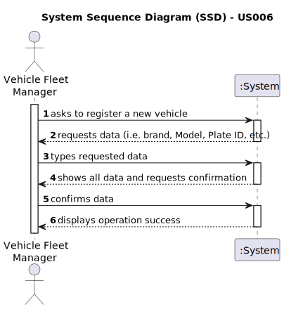

# US006 - Register a vehicle

## 1. Requirements Engineering

### 1.1. User Story Description

As an FM, I wish to register a vehicle including Brand, Model, Type, Tare,
Gross Weight, Current Km, Register Date, Acquisition Date, Maintenance/Checkup Frequency (in Kms).

### 1.2. Customer Specifications and Clarifications 

**From the specifications document:**

>	The registration process should capture essential details about the vehicle.;
>
>   Only VFM is authorized to register vehicles.;

**From the client clarifications:**

> **Question:** For the application to work does the FM need to fill all the attributes of the vehicle?
>
> **Answer:** yes, besides the vehicle plate that by mistake doesn't appear on the text.

> **Question:** When a vehicle is registered, are there specific requirements for accepting the brand? For example, does the system need to check if the brand is on a predetermined list? Does this also apply to the model or any other characteristics?
>
> **Answer:** no; one can consider a list of brands and a list of models previsously inserted in the system, no need to go through validations.

> **Question:** Should the application identify a registered vehicle by a serial number or other attribute?
> 
> **Answer:** By plate id;

### 1.3. Acceptance Criteria

* **AC1:** All input data must be filled out before the registration.
* **AC2:** If any field contains invalid data, an error message should be displayed, and the registration. 
* **AC3:** Allows the VFM to register a vehicle.

### 1.4. Found out Dependencies

* There are not any dependencies.

### 1.5 Input and Output Data

**Input Data:**
* Typed Data
  * Brand
  * Model
  * Type
  * Tare
  * Gross Weight
  * Current Km
  * Register Date
  * Acquisition Date
  * Checkup Frequency (in kms)
  * vehicle plate (ID)

**Output Data:**
* (In)Success of the operation

### 1.6. System Sequence Diagram (SSD)

### 1.7 Other Relevant Remarks
[N/A]