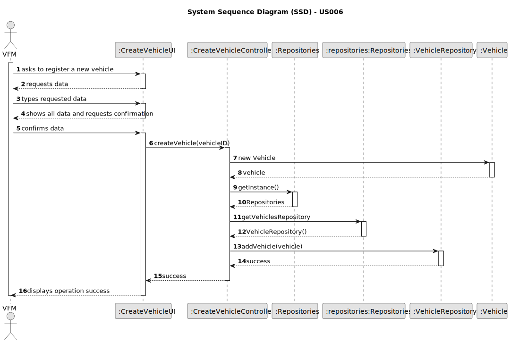
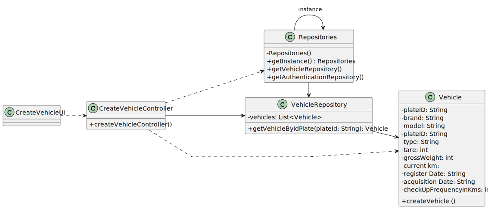

# US006 - Register a vehicle

## 3. Design - User Story Realization 

### 3.1. Rationale

| InteractionID                                       | Question: Which class is responsible for…                 | Answer                    | Justification (with patterns)                             |
|-----------------------------------------------------|-----------------------------------------------------------|---------------------------|-----------------------------------------------------------|
| Step 1 - Ask to Register a New Vehicle              | … interacting with the actor?                            | Create VehicleUI         | Pure Fabrication                                          |
|                                                     | … Coordinating the US?                                    | Create Vehicle Controller | Pure Fabrication (System Interaction Controller)          |
| Step 2 - Requests Data                              | … displaying form for actor input?                        | Create VehicleUI        | Pure Fabrication (Interaction with actor)                 |
| Step 3 - Types Requested Data                       | … Validating input data?   temporarily keeping input data | Create VehicleUI        | Pure Fabrication (Interaction with actor)                 |
| Step 4 - Shows all data and requests Confirmation  | … displaying all the information before submitting?       | Create VehicleUI        | Pure Fabrication (Interaction with actor)                 |
| Step 5 - Confirms data                              | … instantiating a new Vehicle (Object)?                  | Vehicle                   | IE: owns its data                                         |
|                                                     | … validating all data? (Local validation, i.e. mandatory) | Vehicle                   | IE: owns its data                                         |
|                                                     | … validating all data? (Global validation, i.e. duplicates)| Vehicle                   | IE: knows all its Vehicles                                |
|                                                     | … saving the created Vehicle?                             | Vehicle                   | IE: owns its data                                         |
|                                                     | … Saving the inputted data?                               | Vehicle                   | IE: object created previously has its own data            |
| Step 6 - Display operation Success                  | … information on operation success?                      | Create VehicleUI        | Pure Fabrication (Interaction with Actor)                 |

### Systematization ##

According to the taken rationale, the conceptual classes promoted to software classes are:

* Vehicle

Other software classes (i.e. Pure Fabrication) identified:

* CreateVehicleUI
* CreateVehicleController

## 3.2. Sequence Diagram (SD)

_**Note that SSD - Alternative Two is adopted.**_

### Full Diagram

This diagram shows the full sequence of interactions between the classes involved in the realization of this user story.

## 3.3. Class Diagram (CD)

