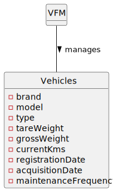

# US008 - List the vehicles needing the check-up.

## 2. OO Analysis

### 2.1. Relevant Domain Model Excerpt 

### 2.2. Other Remarks

O número de kms percorridos pelo veiculo deve ser introduzido ao fim de um intervalo de tempo a definir