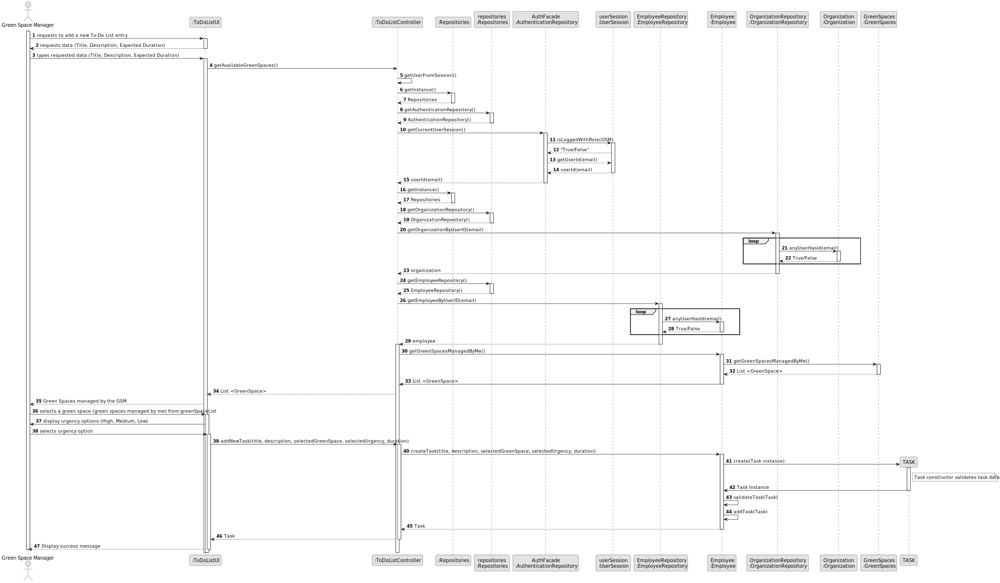
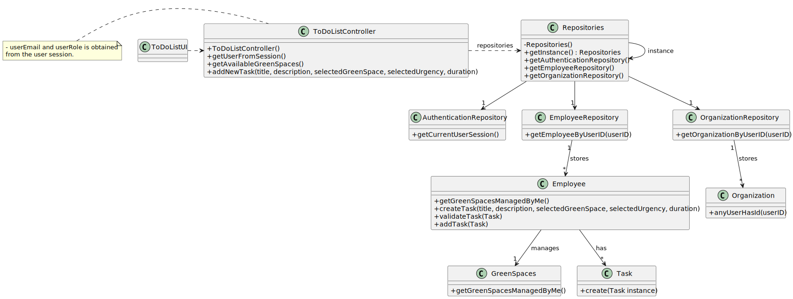

# US021 - Add a New Entry to the To-Do List

## 3. Design - User Story Realization 

### 3.1. Rationale

| Interaction ID                             | Question: Which class is responsible for...                 | Answer                   | Justification (with patterns)                                                                       |
|:-------------------------------------------|:------------------------------------------------------------|:-------------------------|:----------------------------------------------------------------------------------------------------|
| Step 1 - requests to add a new To-Do List entry | ... interacting with the actor?                             | ToDoListUI               | Pure Fabrication: there is no reason to assign this responsibility to any existing class in the DM. |
|                                            | ... coordinating the US?                                    | ToDoListController       | Pure Fabrication (System Interaction Controller)                                                     |
|                                            | ... knowing the user using the system?                      | UserSession              | IE: see Auth component documentation.                                                               |        
| Step 2 - requests data                     | ... displaying form for actor input?                        | ToDoListUI               | Pure Fabrication (Interaction with Actor)                                                             |
| Step 3 - types requested data              | ... temporally keeping input data?                          | ToDoListUI               | Pure Fabrication (Interaction with Actor)                                                             | 
| Step 4 - show To-Do List entry data and request confirmation | ... displaying all the information before submitting?       | ToDoListUI               | Pure Fabrication (Interaction with Actor)                                                             |
| Step 5 - confirms data                     | ... instantiating a new Task (Object)?                      | Employee                     | Creator (Rule 1):  data.                                                     |
|                                            | ... validating all data (local validation,e.g. mandatory)?  | Task                     | IE: owns its data.                                                                                  |
|                                            | ... validating all data (global validation, e.g., duplicates)?| Employee          | IE: knows all Tasks.                                                                               |                                                                       |
| Step 6 - display operation success         | ... informing operation success?                            | ToDoListUI               | Pure Fabrication (Interaction with Actor)                                                           |              

### Systematization

According to the taken rationale, the conceptual classes promoted to software classes are: 

* Task
* GreenSpaces

Other software classes (i.e. Pure Fabrication) identified: 

* ToDoListUI  
* ToDoListController

## 3.2. Sequence Diagram (SD)

## 3.3. Class Diagram (CD)

