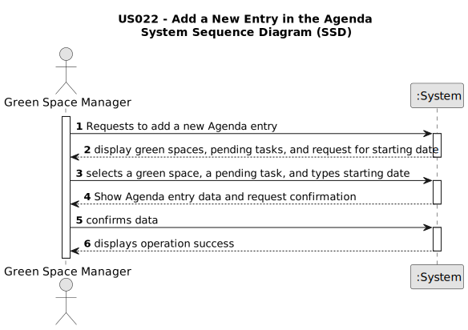

# US022 - Add a New Entry in the Agenda

## 1. Requirements Engineering

### 1.1. User Story Description

As a Green Space Manager (GSM), I want to add a new entry in the Agenda.

### 1.2. Customer Specifications and Clarifications

**From the specifications document:**

> The Agenda is crucial for planning the weekly work. Each entry in the Agenda defines a task that has been included in the To-Do List. The entry will specify the task, the team assigned to it, the green space where it will be carried out, and the expected start and end dates.

**From the client clarifications:**

> **Question:** When do tasks pass to "Planned" status? When they are added to the agenda (before the GSM assigns a team) or when a team is assigned to them?
>
> **Answer:** Assuming you are using states, a task would become "Planned" as soon as it enters the Agenda.

> **Question:** Task duration should be considered in hours or in half days (morning/afternoon)?
>
> **Answer:** Hours should be ok, but keep in mind, that the storage format doesn't need to be same as the input/output format.

> **Question:** When a To-Do List entry is planned and moves to the Agenda, should this entry be removed from the To-Do List or just change status to "Planned" as it is on the Agenda?
>
> **Answer:** Changing the status in the To-Do list to Planned seems to be a good approach.

> **Question:** When registering an entry to the agenda, are the three inputs (selecting an existing task from the to-do list, starting date, and finishing date) sufficient?
>
> **Answer:** The starting date will be enough because the task already has the predicted duration.

> **Question:** Can I add an entry that has a time period that already has an existing entry in the Agenda?
>
> **Answer:** Yes, because:
> a) there are many parks to manage.
> b) different tasks can be executed at the same time in the same park.

> **Question:** When the GSM plans a task (that was previously in To-Do) into the Agenda, what additional data/information does he need to input when planning?
>
> **Answer:** The starting date for the task. Later the GSM will be able to add the Team and vehicles (if required).

> **Question:** When a new entry is added to the To-Do list, the default status of that task will be "Pending". Similarly, when a new entry is added to the Agenda, the status of that task will be, by default, set to "Planned", right?
>
> **Answer:** "Pending" as default for to-do list entries and "Planned" as default for Agenda entries sounds good.

### 1.3. Acceptance Criteria

* **AC1** The new entry must be associated with a green space managed by the GSM.
* **AC2** The new entry must exist in the To-Do list.
* **AC3** When the GSM adds a new entry to the Agenda, the status of the task should be set to "Planned" in the Agenda and in the To-do list.
* **AC4** The starting date for the task must be provided.

### 1.4. Found out Dependencies

There is a dependency on:

* [US21]-> As a GSM,I want to add a new entry to the To-Do List.

### 1.5 Input and Output Data

**Input Data:**

* Typed data:
  - Starting date for the task

* Selected data:
  - Task from the To-Do list
  - Green space

**Output Data:**

* (in)success of the operation

### 1.6. System Sequence Diagram (SSD)

