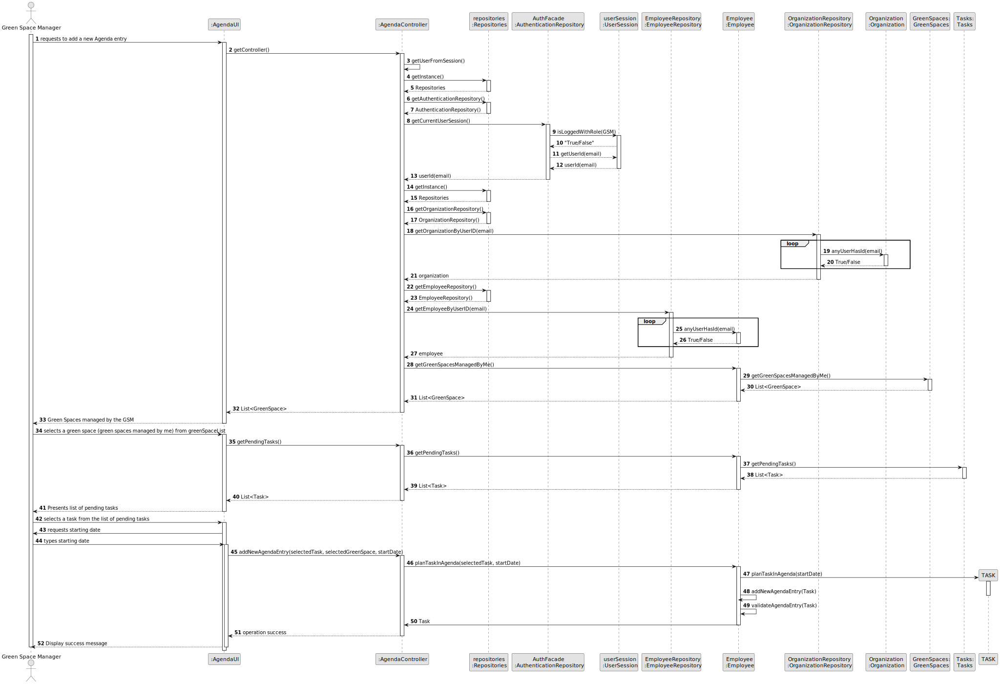
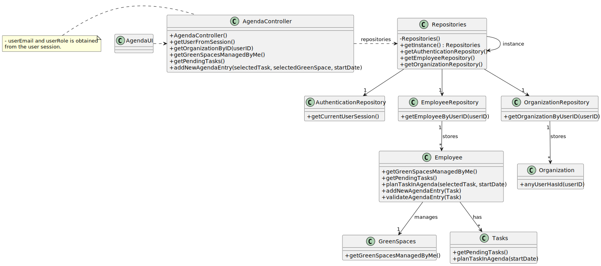

# US022 - Add a New Entry in the Agenda

## 3. Design - User Story Realization 

### 3.1. Rationale

### 3.1. Rationale

| Interaction ID                               | Question: Which class is responsible for...                   | Answer                   | Justification (with patterns)                                                                       |
|:---------------------------------------------|:--------------------------------------------------------------|:-------------------------|:----------------------------------------------------------------------------------------------------|
| Step 1 - requests to add a new Agenda entry  | ... interacting with the actor?                               | AgendaUI                 | Pure Fabrication: there is no reason to assign this responsibility to any existing class in the DM. |
|                                              | ... coordinating the US?                                      | AgendaController         | Pure Fabrication (System Interaction Controller)                                                    |
|                                              | ... knowing the user using the system?                        | UserSession              | IE: see Auth component documentation.                                                               |
| Step 2 - getPendingTasks                     | ... fetching pending tasks from the repository?               | TaskRepository           | IE: knows all tasks.                                                                                |
| Step 3 - getAvailableGreenSpaces             | ... fetching available green spaces from the repository?      | GreenSpaceRepository     | IE: knows all green spaces.                                                                         |
| Step 4 - addNewAgendaEntry                   | ... instantiating the selected Task with startDate?           | Employee                 | Creator                                 |
|                                              | ... validating all data (local validation, e.g., mandatory)?  | Task                     | IE: owns its data.                                                                                  |
|                                              | ... validating all data (global validation, e.g., duplicates)?| Employee          | IE: knows all tasks.                                                                                |
| Step 5 - display operation success           | ... informing operation success?                              | AgendaUI                 | Pure Fabrication (Interaction with Actor)                                                           |

### Systematization

According to the rationale taken, the conceptual classes promoted to software classes are:

[N/A]

Other software classes (i.e., Pure Fabrication) identified:

* AgendaUI  
* AgendaController
* Tasks

## 3.2. Sequence Diagram (SD)

## 3.3. Class Diagram (CD)

