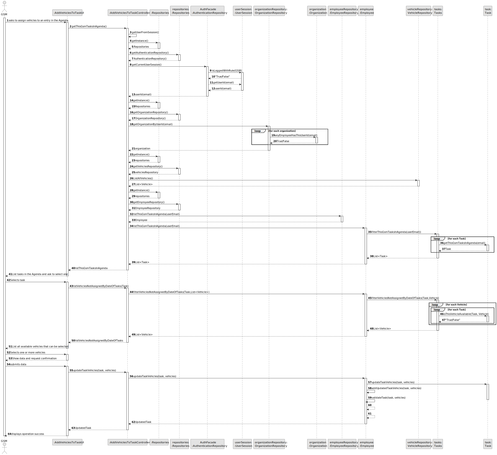
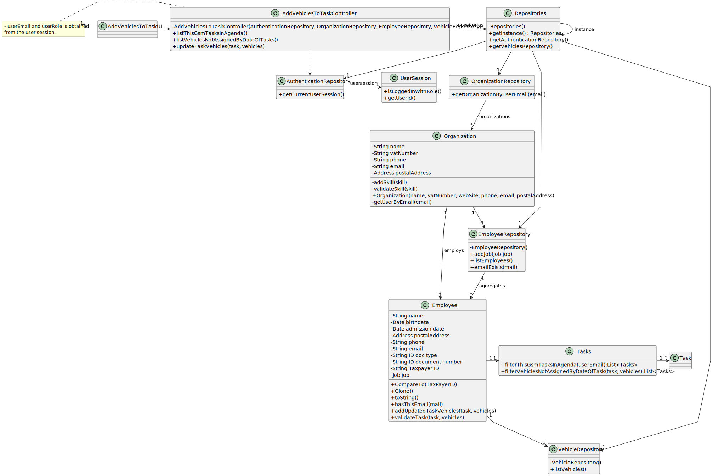

# US026 - As a GSM, I want to assign one or more vehicles to an entry in the Agenda. 

## 3. Design - User Story Realization 

### 3.1. Rationale

| Interaction ID                                            | Question: Which class is responsible for...                    | Answer                      | Justification (with patterns)                                                                       |
|:----------------------------------------------------------|:---------------------------------------------------------------|:----------------------------|:----------------------------------------------------------------------------------------------------|
| Step 1 - ask to assign vehicles to an entry in the Agenda | ... interacting with the actor?                                | AddVehiclesToTaskUI         | Pure Fabrication: there is no reason to assign this responsibility to any existing class in the DM. |
|                                                           | ... coordinating the US?                                       | AddVehiclesToTaskController | Controller                                                                                          |
| Step 2 - List tasks in the Agenda and ask to select one.  | ... knowing the user using the system?                         | UserSession                 | IE: see Auth component documentation.                                                               |
|                                                           | ... knowing the tasks to show?                                 | Employee                    | IE: knows all tasks.                                                                                |
|                                                           | ... displaying list for actor input selection?                 | AddVehiclesToTaskUI         | Pure Fabrication(Interation with Actor)                                                             |
| Step 3 - Select task                                      | ... temporally keeping input data?                             | AddVehiclesToTaskUI         | Pure Fabrication(Interation with Actor)                                                             | 
| Step 4 - List all available vehicles tha can be selected  | ... knowing the vehicles to show?                              | Employee                    | IE: knows all vehicles                                                                              |
| Step 5 - Selects vehicles                                 | ... temporally keeping input data?                             | AddVehiclesToTaskUI         | Pure Fabrication(Interation with Actor)                                                             |
| Step 6 - Show data an request confirmation                | ... displaying all the information before submitting?          | AddVehiclesToTaskUI         | Pure Fabrication(Interation with Actor)                                                             |                                                                                                                                               
| Step 7 - confirms data		                             | ... validating global data (global validation,i.e.duplicates)? | Employee                    | IE: knows all its tasks.                                                                            |
| 			  		                                         | ... validating local data (Bussiness rules)                    | Task                        | IE: knows is own data.                                                                              |
| 		                                                     | ... saving the inputted data?                                  | Task                        | IE: object created previously has its own data.                                                     |
| Step 8 - display operation sucess	  	                 | ... information operation sucess?                              | AddVehiclesToTaskUI         | PureFabrication(Interation with Actor)                                                              |              

### Systematization ##

According to the taken rationale, the conceptual classes promoted to software classes are: 

* Employee
* Task

Other software classes (i.e. Pure Fabrication) identified: 

* AddVehiclesToTaskUI  
* AddVehiclesToTaskController

## 3.2. Sequence Diagram (SD)

### Full Diagram

This diagram shows the full sequence of interactions between the classes involved in the realization of this user story.

## 3.3. Class Diagram (CD)

