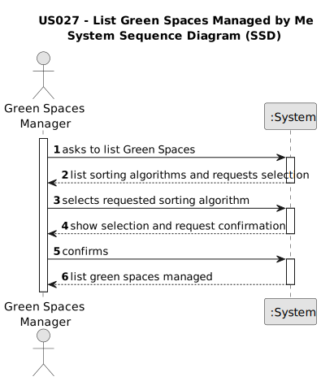

# US0027 - As a GSM, I need to list all green spaces managed by me.

## 1. Requirements Engineering

### 1.1. User Story Description

As a Green Spaces Manager in the organization, I want to list all green spaces managed by me.

### 1.2. Customer Specifications and Clarifications 

**From the specifications document:**

The main occupation of employees such as designer, estimator, gardener, electrician, or mason, being inputted by the HRM.

**From client meeting:**

Client clarification, just a Job Name insertion is needed.

### 1.3. Acceptance Criteria

**AC1** - The list of green spaces must be sorted by size in descending order (area in hectares should be used). The sorting algorithm to be used by the application must be defined through a configuration file. At least two sorting algorithms should be available.

### 1.4. Found out Dependencies

None.

### 1.5 Input and Output Data

**Input Data:** 
* Configuration File
  * 2 sorting algorithms. 
* Selected data: 
  * Sorting algorithm

**Output Data:**
  *List of green spaces

* (In)Success of the operation

### 1.6. System Sequence Diagram (SSD)

### 1.7 Other Relevant Remarks

  

