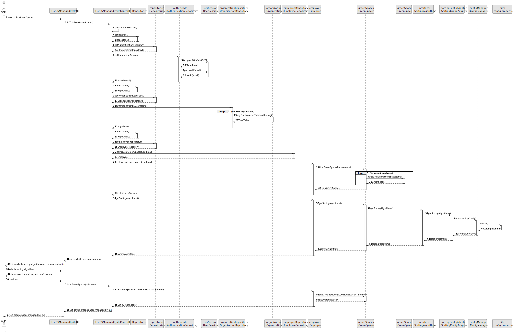
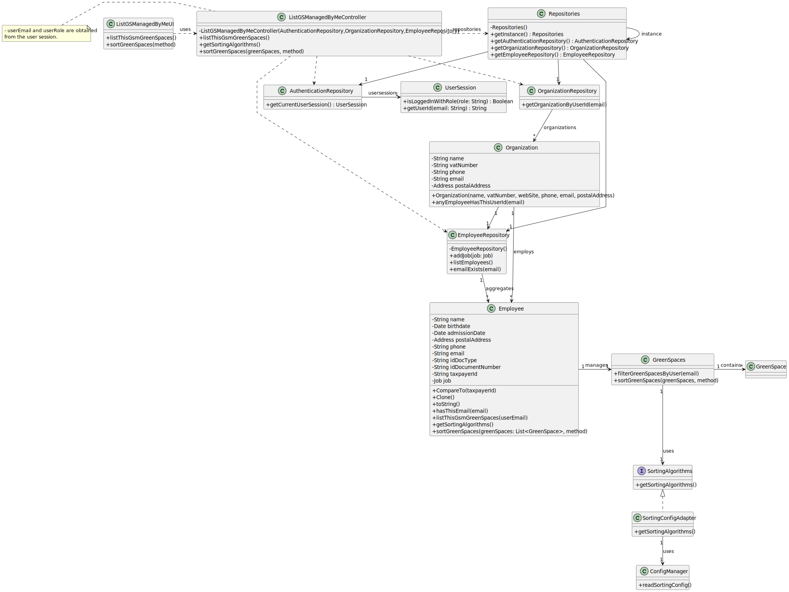

# US0027 - As a GSM, I need to list all green spaces managed by me. 

## 3. Design - User Story Realization 

### 3.1. Rationale

| Interaction ID                                                    | Question: Which class is responsible for...           | Answer                        | Justification (with patterns)                                                                       |
|:------------------------------------------------------------------|:------------------------------------------------------|:------------------------------|:----------------------------------------------------------------------------------------------------|
| Step 1 - asks to list Green Spaces		                              | ... interacting with the actor?                       | ListGSManagedByMeUI           | Pure Fabrication: there is no reason to assign this responsibility to any existing class in the DM. |
|                                                                   | ... coordinating the US?                              | ListGSManagedByMeController   | Controller                                                                                          |
|                                                                   | ... use configuration file                            | Interface <SortingAlgorithms> | Pure Fabrication (Adapter)                                                                          |
| Step 2 - list available sorting algorithms and requests selection | ... displaying form for actor input?                  | ListGSManagedByMeUI           | Pure Fabrication(Interaction with Actor)                                                            |
| Step 3 - selects sorting algorithm                                | ... temporally keeping input data?                     | ListGSManagedByMeUI           | Pure Fabrication(Interaction with Actor)                                                            | 
| Step 4 - show selection and request confirmation                  | ... displaying all the information before submitting? | ListGSManagedByMeUI           | Pure Fabrication(Interaction with Actor)                                                            |
| Step 5 - confirms 			                                             | ... knowing the user using the system?                | UserSession                   | IE: see Auth component documentation.                                                               |        
|                                                                   | ... who knows all GreenSpaces                         | Employee                      | IE: knows all its GreenSpaces.                                                                      |
|                                                                   | ... who knows is manager?                             | GreenSpace                    | IE: knows all its data.                                                                             |
| Step 6 - list green spaces managed by me	  	                      | ... show information?                                 | ListGSManagedByMeUI           | PureFabrication(Interaction with Actor)                                                             |              

### Systematization ##

According to the taken rationale, the conceptual classes promoted to software classes are: 

* GreenSpace
* Employee

Other software classes (i.e. Pure Fabrication) identified: 

* ListGSManagedByMeUI  
* ListGSManagedByMeController
* Interface <SortingAlgorithms>

## 3.2. Sequence Diagram (SD)

### Full Diagram

This diagram shows the full sequence of interactions between the classes involved in the realization of this user story.

## 3.3. Class Diagram (CD)

